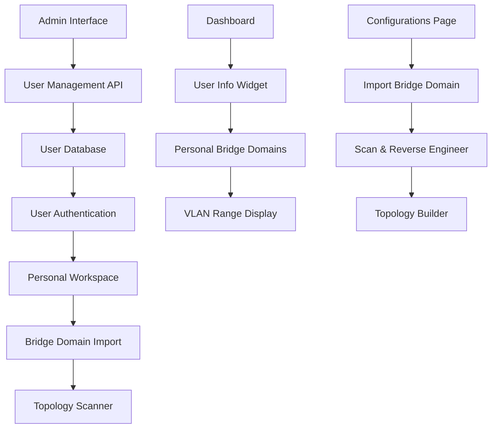

# User Management System - High-Level Design (HLD)

## **Overview**

This HLD defines the user management system for the Bridge Domain Topology Editor, including admin-only user creation, user management interface, dashboard enhancements, and bridge domain import functionality.

## **System Architecture**

### **1. User Management Components**



## **2. Database Schema Extensions**

### **User Management Tables**

```sql
-- Users table
CREATE TABLE users (
    id INTEGER PRIMARY KEY,
    username VARCHAR(50) UNIQUE NOT NULL,
    email VARCHAR(100) UNIQUE,
    password_hash VARCHAR(255) NOT NULL,
    is_active BOOLEAN DEFAULT TRUE,
    is_admin BOOLEAN DEFAULT FALSE,
    created_by INTEGER,  -- Admin who created this user
    created_at TIMESTAMP DEFAULT CURRENT_TIMESTAMP,
    last_login TIMESTAMP,
    FOREIGN KEY (created_by) REFERENCES users(id)
);

-- User VLAN allocations
CREATE TABLE user_vlan_allocations (
    id INTEGER PRIMARY KEY,
    user_id INTEGER NOT NULL,
    start_vlan INTEGER NOT NULL,
    end_vlan INTEGER NOT NULL,
    description VARCHAR(200),
    is_active BOOLEAN DEFAULT TRUE,
    created_at TIMESTAMP DEFAULT CURRENT_TIMESTAMP,
    FOREIGN KEY (user_id) REFERENCES users(id)
);

-- User permissions
CREATE TABLE user_permissions (
    id INTEGER PRIMARY KEY,
    user_id INTEGER NOT NULL,
    can_edit_topology BOOLEAN DEFAULT TRUE,
    can_deploy_changes BOOLEAN DEFAULT TRUE,
    can_view_global BOOLEAN DEFAULT FALSE,
    can_edit_others BOOLEAN DEFAULT FALSE,
    max_bridge_domains INTEGER DEFAULT 50,
    require_approval BOOLEAN DEFAULT FALSE,
    created_at TIMESTAMP DEFAULT CURRENT_TIMESTAMP,
    FOREIGN KEY (user_id) REFERENCES users(id)
);

-- Personal workspace bridge domains
CREATE TABLE personal_bridge_domains (
    id INTEGER PRIMARY KEY,
    user_id INTEGER NOT NULL,
    bridge_domain_name VARCHAR(100) NOT NULL,
    imported_from_topology BOOLEAN DEFAULT FALSE,
    topology_scanned BOOLEAN DEFAULT FALSE,
    last_scan_at TIMESTAMP,
    created_at TIMESTAMP DEFAULT CURRENT_TIMESTAMP,
    FOREIGN KEY (user_id) REFERENCES users(id)
);
```

## **3. Admin Interface Design**

### **Admin User Management Page**

```typescript
// Admin User Management Component
interface AdminUserManagementProps {
  currentUser: User;
}

const AdminUserManagement: React.FC<AdminUserManagementProps> = ({ currentUser }) => {
  const [users, setUsers] = useState<User[]>([]);
  const [selectedUser, setSelectedUser] = useState<User | null>(null);
  const [showCreateForm, setShowCreateForm] = useState(false);
  const [showEditForm, setShowEditForm] = useState(false);

  return (
    <div className="admin-user-management">
      <div className="admin-header">
        <h1>User Management</h1>
        <button 
          className="btn btn-primary"
          onClick={() => setShowCreateForm(true)}
        >
          Create New User
        </button>
      </div>

      <div className="user-list">
        <table className="user-table">
          <thead>
            <tr>
              <th>Username</th>
              <th>Email</th>
              <th>VLAN Ranges</th>
              <th>Permissions</th>
              <th>Status</th>
              <th>Actions</th>
            </tr>
          </thead>
          <tbody>
            {users.map(user => (
              <tr key={user.id}>
                <td>{user.username}</td>
                <td>{user.email}</td>
                <td>
                  {user.vlanRanges.map(range => 
                    `${range.startVlan}-${range.endVlan}`
                  ).join(', ')}
                </td>
                <td>
                  <span className={`permission-badge ${user.permissions.canEditTopology ? 'active' : 'inactive'}`}>
                    Edit
                  </span>
                  <span className={`permission-badge ${user.permissions.canDeployChanges ? 'active' : 'inactive'}`}>
                    Deploy
                  </span>
                  <span className={`permission-badge ${user.permissions.canViewGlobal ? 'active' : 'inactive'}`}>
                    Global View
                  </span>
                </td>
                <td>
                  <span className={`status-badge ${user.isActive ? 'active' : 'inactive'}`}>
                    {user.isActive ? 'Active' : 'Inactive'}
                  </span>
                </td>
                <td>
                  <button 
                    className="btn btn-sm btn-secondary"
                    onClick={() => handleEditUser(user)}
                  >
                    Edit
                  </button>
                  <button 
                    className="btn btn-sm btn-danger"
                    onClick={() => handleDeleteUser(user.id)}
                  >
                    Delete
                  </button>
                </td>
              </tr>
            ))}
          </tbody>
        </table>
      </div>

      {/* Create User Modal */}
      {showCreateForm && (
        <CreateUserModal
          onClose={() => setShowCreateForm(false)}
          onUserCreated={handleUserCreated}
        />
      )}

      {/* Edit User Modal */}
      {showEditForm && selectedUser && (
        <EditUserModal
          user={selectedUser}
          onClose={() => setShowEditForm(false)}
          onUserUpdated={handleUserUpdated}
        />
      )}
    </div>
  );
};
```

### **Create User Modal**

```typescript
interface CreateUserModalProps {
  onClose: () => void;
  onUserCreated: (user: User) => void;
}

const CreateUserModal: React.FC<CreateUserModalProps> = ({ onClose, onUserCreated }) => {
  const [formData, setFormData] = useState({
    username: '',
    email: '',
    password: '',
    vlanRanges: [{ startVlan: 0, endVlan: 0, description: '' }],
    permissions: {
      canEditTopology: true,
      canDeployChanges: true,
      canViewGlobal: false,
      canEditOthers: false,
      maxBridgeDomains: 50,
      requireApproval: false
    }
  });

  const handleSubmit = async (e: React.FormEvent) => {
    e.preventDefault();
    
    try {
      const response = await fetch('/api/admin/users', {
        method: 'POST',
        headers: { 'Content-Type': 'application/json' },
        body: JSON.stringify(formData)
      });
      
      if (response.ok) {
        const newUser = await response.json();
        onUserCreated(newUser);
        onClose();
      }
    } catch (error) {
      console.error('Failed to create user:', error);
    }
  };

  return (
    <div className="modal-overlay">
      <div className="modal">
        <div className="modal-header">
          <h2>Create New User</h2>
          <button className="close-btn" onClick={onClose}>×</button>
        </div>

        <form onSubmit={handleSubmit}>
          <div className="form-group">
            <label>Username</label>
            <input
              type="text"
              value={formData.username}
              onChange={(e) => setFormData({...formData, username: e.target.value})}
              required
            />
          </div>

          <div className="form-group">
            <label>Email</label>
            <input
              type="email"
              value={formData.email}
              onChange={(e) => setFormData({...formData, email: e.target.value})}
              required
            />
          </div>

          <div className="form-group">
            <label>Password</label>
            <input
              type="password"
              value={formData.password}
              onChange={(e) => setFormData({...formData, password: e.target.value})}
              required
            />
          </div>

          <div className="form-group">
            <label>VLAN Ranges</label>
            {formData.vlanRanges.map((range, index) => (
              <div key={index} className="vlan-range-input">
                <input
                  type="number"
                  placeholder="Start VLAN"
                  value={range.startVlan}
                  onChange={(e) => handleVlanRangeChange(index, 'startVlan', parseInt(e.target.value))}
                />
                <span>-</span>
                <input
                  type="number"
                  placeholder="End VLAN"
                  value={range.endVlan}
                  onChange={(e) => handleVlanRangeChange(index, 'endVlan', parseInt(e.target.value))}
                />
                <input
                  type="text"
                  placeholder="Description"
                  value={range.description}
                  onChange={(e) => handleVlanRangeChange(index, 'description', e.target.value)}
                />
                <button 
                  type="button" 
                  onClick={() => removeVlanRange(index)}
                  className="btn btn-sm btn-danger"
                >
                  Remove
                </button>
              </div>
            ))}
            <button 
              type="button" 
              onClick={addVlanRange}
              className="btn btn-sm btn-secondary"
            >
              Add VLAN Range
            </button>
          </div>

          <div className="form-group">
            <label>Permissions</label>
            <div className="permissions-grid">
              <label>
                <input
                  type="checkbox"
                  checked={formData.permissions.canEditTopology}
                  onChange={(e) => setFormData({
                    ...formData, 
                    permissions: {...formData.permissions, canEditTopology: e.target.checked}
                  })}
                />
                Can Edit Topology
              </label>
              <label>
                <input
                  type="checkbox"
                  checked={formData.permissions.canDeployChanges}
                  onChange={(e) => setFormData({
                    ...formData, 
                    permissions: {...formData.permissions, canDeployChanges: e.target.checked}
                  })}
                />
                Can Deploy Changes
              </label>
              <label>
                <input
                  type="checkbox"
                  checked={formData.permissions.canViewGlobal}
                  onChange={(e) => setFormData({
                    ...formData, 
                    permissions: {...formData.permissions, canViewGlobal: e.target.checked}
                  })}
                />
                Can View Global Topology
              </label>
              <label>
                <input
                  type="checkbox"
                  checked={formData.permissions.canEditOthers}
                  onChange={(e) => setFormData({
                    ...formData, 
                    permissions: {...formData.permissions, canEditOthers: e.target.checked}
                  })}
                />
                Can Edit Others' Configurations
              </label>
            </div>
          </div>

          <div className="form-actions">
            <button type="button" onClick={onClose} className="btn btn-secondary">
              Cancel
            </button>
            <button type="submit" className="btn btn-primary">
              Create User
            </button>
          </div>
        </form>
      </div>
    </div>
  );
};
```

## **4. Dashboard Enhancements**

### **User Information Widget**

```typescript
// User Info Widget Component
interface UserInfoWidgetProps {
  user: User;
}

const UserInfoWidget: React.FC<UserInfoWidgetProps> = ({ user }) => {
  const [personalStats, setPersonalStats] = useState({
    totalBridgeDomains: 0,
    activeBridgeDomains: 0,
    vlanRangesUsed: [],
    lastActivity: null
  });

  useEffect(() => {
    fetchPersonalStats();
  }, [user.id]);

  return (
    <div className="user-info-widget">
      <div className="widget-header">
        <h3>My Information</h3>
        <span className="user-status active">Active</span>
      </div>

      <div className="user-details">
        <div className="user-avatar">
          <span className="avatar-text">{user.username.charAt(0).toUpperCase()}</span>
        </div>
        
        <div className="user-info">
          <h4>{user.username}</h4>
          <p>{user.email}</p>
        </div>
      </div>

      <div className="vlan-ranges">
        <h5>My VLAN Ranges</h5>
        <div className="vlan-range-list">
          {user.vlanRanges.map((range, index) => (
            <div key={index} className="vlan-range-item">
              <span className="range">{range.startVlan}-{range.endVlan}</span>
              <span className="description">{range.description}</span>
            </div>
          ))}
        </div>
      </div>

      <div className="personal-stats">
        <div className="stat-item">
          <span className="stat-label">My Bridge Domains</span>
          <span className="stat-value">{personalStats.totalBridgeDomains}</span>
        </div>
        
        <div className="stat-item">
          <span className="stat-label">Active Configurations</span>
          <span className="stat-value">{personalStats.activeBridgeDomains}</span>
        </div>
        
        <div className="stat-item">
          <span className="stat-label">VLANs Used</span>
          <span className="stat-value">{personalStats.vlanRangesUsed.length}</span>
        </div>
      </div>

      <div className="quick-actions">
        <button className="btn btn-sm btn-primary">
          Import Bridge Domain
        </button>
        <button className="btn btn-sm btn-secondary">
          View My Configurations
        </button>
      </div>
    </div>
  );
};
```

## **5. Enhanced Configurations Page**

### **"My Configurations" Page**

```typescript
// My Configurations Component
interface MyConfigurationsProps {
  user: User;
}

const MyConfigurations: React.FC<MyConfigurationsProps> = ({ user }) => {
  const [personalBridgeDomains, setPersonalBridgeDomains] = useState<BridgeDomain[]>([]);
  const [showImportModal, setShowImportModal] = useState(false);
  const [importableBridgeDomains, setImportableBridgeDomains] = useState<BridgeDomain[]>([]);

  useEffect(() => {
    fetchPersonalBridgeDomains();
  }, [user.id]);

  const handleImportBridgeDomain = async (bridgeDomainName: string) => {
    try {
      const response = await fetch('/api/configurations/import', {
        method: 'POST',
        headers: { 'Content-Type': 'application/json' },
        body: JSON.stringify({
          bridgeDomainName,
          userId: user.id
        })
      });

      if (response.ok) {
        // Refresh personal bridge domains
        fetchPersonalBridgeDomains();
        setShowImportModal(false);
      }
    } catch (error) {
      console.error('Failed to import bridge domain:', error);
    }
  };

  const handleScanBridgeDomain = async (bridgeDomainName: string) => {
    try {
      const response = await fetch(`/api/configurations/${bridgeDomainName}/scan`, {
        method: 'POST',
        headers: { 'Content-Type': 'application/json' }
      });

      if (response.ok) {
        // Refresh the bridge domain data
        fetchPersonalBridgeDomains();
      }
    } catch (error) {
      console.error('Failed to scan bridge domain:', error);
    }
  };

  return (
    <div className="my-configurations">
      <div className="page-header">
        <h1>My Configurations</h1>
        <button 
          className="btn btn-primary"
          onClick={() => setShowImportModal(true)}
        >
          Import Bridge Domain
        </button>
      </div>

      <div className="configurations-grid">
        {personalBridgeDomains.map(bridgeDomain => (
          <div key={bridgeDomain.name} className="configuration-card">
            <div className="card-header">
              <h3>{bridgeDomain.name}</h3>
              <span className={`status-badge ${bridgeDomain.status}`}>
                {bridgeDomain.status}
              </span>
            </div>

            <div className="card-content">
              <div className="bridge-domain-info">
                <p><strong>VLAN:</strong> {bridgeDomain.vlanId}</p>
                <p><strong>Topology:</strong> {bridgeDomain.topologyType}</p>
                <p><strong>Devices:</strong> {bridgeDomain.devices.length}</p>
                <p><strong>Interfaces:</strong> {bridgeDomain.totalInterfaces}</p>
              </div>

              <div className="scan-status">
                {bridgeDomain.topologyScanned ? (
                  <span className="scan-status scanned">
                    ✓ Topology Scanned
                  </span>
                ) : (
                  <span className="scan-status not-scanned">
                    ⚠ Not Scanned
                  </span>
                )}
              </div>
            </div>

            <div className="card-actions">
              <button 
                className="btn btn-sm btn-primary"
                onClick={() => handleScanBridgeDomain(bridgeDomain.name)}
                disabled={bridgeDomain.topologyScanned}
              >
                {bridgeDomain.topologyScanned ? 'Re-scan' : 'Scan Topology'}
              </button>
              
              <button className="btn btn-sm btn-secondary">
                Edit
              </button>
              
              <button className="btn btn-sm btn-danger">
                Remove
              </button>
            </div>
          </div>
        ))}
      </div>

      {/* Import Bridge Domain Modal */}
      {showImportModal && (
        <ImportBridgeDomainModal
          user={user}
          importableBridgeDomains={importableBridgeDomains}
          onImport={handleImportBridgeDomain}
          onClose={() => setShowImportModal(false)}
        />
      )}
    </div>
  );
};
```

### **Import Bridge Domain Modal**

```typescript
interface ImportBridgeDomainModalProps {
  user: User;
  importableBridgeDomains: BridgeDomain[];
  onImport: (bridgeDomainName: string) => void;
  onClose: () => void;
}

const ImportBridgeDomainModal: React.FC<ImportBridgeDomainModalProps> = ({
  user,
  importableBridgeDomains,
  onImport,
  onClose
}) => {
  const [selectedBridgeDomain, setSelectedBridgeDomain] = useState<string>('');

  const filteredBridgeDomains = importableBridgeDomains.filter(bd => {
    // Filter by user's VLAN ranges
    return user.vlanRanges.some(range => 
      bd.vlanId >= range.startVlan && bd.vlanId <= range.endVlan
    );
  });

  return (
    <div className="modal-overlay">
      <div className="modal">
        <div className="modal-header">
          <h2>Import Bridge Domain</h2>
          <button className="close-btn" onClick={onClose}>×</button>
        </div>

        <div className="modal-content">
          <p>Select a bridge domain from the topology that matches your VLAN ranges:</p>
          
          <div className="bridge-domain-list">
            {filteredBridgeDomains.map(bd => (
              <div 
                key={bd.name} 
                className={`bridge-domain-item ${selectedBridgeDomain === bd.name ? 'selected' : ''}`}
                onClick={() => setSelectedBridgeDomain(bd.name)}
              >
                <div className="bridge-domain-info">
                  <h4>{bd.name}</h4>
                  <p>VLAN: {bd.vlanId}</p>
                  <p>Topology: {bd.topologyType}</p>
                  <p>Devices: {bd.devices.length}</p>
                </div>
                
                <div className="vlan-range-match">
                  {user.vlanRanges.map(range => 
                    bd.vlanId >= range.startVlan && bd.vlanId <= range.endVlan ? (
                      <span key={range.startVlan} className="match-badge">
                        Matches {range.startVlan}-{range.endVlan}
                      </span>
                    ) : null
                  )}
                </div>
              </div>
            ))}
          </div>

          {filteredBridgeDomains.length === 0 && (
            <div className="no-bridge-domains">
              <p>No bridge domains found that match your VLAN ranges.</p>
              <p>Your VLAN ranges: {user.vlanRanges.map(r => `${r.startVlan}-${r.endVlan}`).join(', ')}</p>
            </div>
          )}
        </div>

        <div className="modal-actions">
          <button type="button" onClick={onClose} className="btn btn-secondary">
            Cancel
          </button>
          <button 
            type="button" 
            onClick={() => onImport(selectedBridgeDomain)}
            disabled={!selectedBridgeDomain}
            className="btn btn-primary"
          >
            Import Selected Bridge Domain
          </button>
        </div>
      </div>
    </div>
  );
};
```

## **6. API Endpoints**

### **Admin User Management APIs**

```python
# Admin User Management Endpoints
@app.route('/api/admin/users', methods=['GET'])
@admin_required
def get_users():
    """Get all users (admin only)"""
    users = db_manager.get_all_users()
    return jsonify(users)

@app.route('/api/admin/users', methods=['POST'])
@admin_required
def create_user():
    """Create new user (admin only)"""
    data = request.json
    
    # Validate input
    if not data.get('username') or not data.get('password'):
        return jsonify({'error': 'Username and password required'}), 400
    
    # Create user
    user_id = db_manager.create_user(
        username=data['username'],
        email=data.get('email'),
        password_hash=hash_password(data['password']),
        created_by=current_user.id
    )
    
    # Create VLAN allocations
    for vlan_range in data.get('vlanRanges', []):
        db_manager.create_vlan_allocation(
            user_id=user_id,
            start_vlan=vlan_range['startVlan'],
            end_vlan=vlan_range['endVlan'],
            description=vlan_range.get('description', '')
        )
    
    # Create permissions
    db_manager.create_user_permissions(
        user_id=user_id,
        permissions=data.get('permissions', {})
    )
    
    return jsonify({'success': True, 'user_id': user_id}), 201

@app.route('/api/admin/users/<int:user_id>', methods=['PUT'])
@admin_required
def update_user(user_id):
    """Update user (admin only)"""
    data = request.json
    
    # Update user
    db_manager.update_user(user_id, data)
    
    # Update VLAN allocations
    if 'vlanRanges' in data:
        db_manager.update_user_vlan_allocations(user_id, data['vlanRanges'])
    
    # Update permissions
    if 'permissions' in data:
        db_manager.update_user_permissions(user_id, data['permissions'])
    
    return jsonify({'success': True})

@app.route('/api/admin/users/<int:user_id>', methods=['DELETE'])
@admin_required
def delete_user(user_id):
    """Delete user (admin only)"""
    db_manager.delete_user(user_id)
    return jsonify({'success': True})
```

### **Personal Bridge Domain APIs**

```python
# Personal Bridge Domain Management
@app.route('/api/configurations/import', methods=['POST'])
@login_required
def import_bridge_domain():
    """Import bridge domain to personal workspace"""
    data = request.json
    bridge_domain_name = data.get('bridgeDomainName')
    user_id = current_user.id
    
    # Check if user has access to this bridge domain
    if not user_has_access_to_bridge_domain(user_id, bridge_domain_name):
        return jsonify({'error': 'Access denied to this bridge domain'}), 403
    
    # Import to personal workspace
    db_manager.import_bridge_domain_to_personal_workspace(
        user_id=user_id,
        bridge_domain_name=bridge_domain_name
    )
    
    return jsonify({'success': True})

@app.route('/api/configurations/<bridge_domain_name>/scan', methods=['POST'])
@login_required
def scan_bridge_domain_topology(bridge_domain_name):
    """Scan and reverse engineer bridge domain topology"""
    user_id = current_user.id
    
    # Check ownership
    if not user_owns_bridge_domain(user_id, bridge_domain_name):
        return jsonify({'error': 'Access denied'}), 403
    
    # Perform topology scan
    try:
        topology_data = topology_scanner.scan_bridge_domain_topology(bridge_domain_name)
        
        # Save topology data
        db_manager.save_bridge_domain_topology(
            bridge_domain_name=bridge_domain_name,
            topology_data=topology_data,
            scanned_by=user_id
        )
        
        return jsonify({
            'success': True,
            'topology_data': topology_data
        })
        
    except Exception as e:
        return jsonify({'error': f'Scan failed: {str(e)}'}), 500

@app.route('/api/dashboard/personal-stats', methods=['GET'])
@login_required
def get_personal_stats():
    """Get personal statistics for dashboard"""
    user_id = current_user.id
    
    stats = db_manager.get_personal_stats(user_id)
    
    return jsonify(stats)
```

## **7. Navigation Updates**

### **Updated Sidebar Navigation**

```typescript
// Updated Navigation Component
const Navigation: React.FC = () => {
  const { user } = useAuth();
  
  return (
    <nav className="sidebar">
      <div className="nav-header">
        <h2>Bridge Domain Editor</h2>
      </div>
      
      <ul className="nav-menu">
        <li className="nav-item">
          <Link to="/dashboard" className="nav-link">
            <i className="icon-dashboard"></i>
            Dashboard
          </Link>
        </li>
        
        <li className="nav-item">
          <Link to="/topology" className="nav-link">
            <i className="icon-topology"></i>
            Topology Discovery
          </Link>
        </li>
        
        <li className="nav-item">
          <Link to="/configurations" className="nav-link">
            <i className="icon-configurations"></i>
            My Configurations
          </Link>
        </li>
        
        {user.isAdmin && (
          <li className="nav-item">
            <Link to="/admin/users" className="nav-link">
              <i className="icon-users"></i>
              User Management
            </Link>
          </li>
        )}
        
        <li className="nav-item">
          <Link to="/profile" className="nav-link">
            <i className="icon-profile"></i>
            Profile
          </Link>
        </li>
      </ul>
    </nav>
  );
};
```

## **8. Implementation Timeline**

### **Phase 1: User Management Foundation (2 weeks)**
1. **Database Schema** - Create user management tables
2. **Admin Interface** - User creation and management UI
3. **Authentication** - User login and session management
4. **VLAN Range System** - User VLAN allocation management

### **Phase 2: Dashboard & Personal Workspace (1 week)**
1. **User Info Widget** - Personal statistics display
2. **Personal Bridge Domains** - User-specific bridge domain list
3. **Navigation Updates** - Rename "Configurations" to "My Configurations"

### **Phase 3: Bridge Domain Import System (2 weeks)**
1. **Import Modal** - Bridge domain selection interface
2. **VLAN Range Filtering** - Filter by user's VLAN ranges
3. **Personal Workspace** - Import bridge domains to personal space
4. **Topology Scanner** - Scan and reverse engineer imported bridge domains

### **Phase 4: Integration & Testing (1 week)**
1. **API Integration** - Connect all components
2. **Error Handling** - Comprehensive error management
3. **Testing** - User acceptance testing
4. **Documentation** - User and admin guides

## **9. Security Considerations**

### **Access Control**
- **Admin-only user creation** - Only admins can create users
- **VLAN range validation** - Users can only access bridge domains in their VLAN ranges
- **Permission-based access** - Granular permissions for different operations
- **Session management** - Secure user sessions with timeout

### **Data Protection**
- **Password hashing** - Secure password storage
- **Input validation** - Validate all user inputs
- **SQL injection prevention** - Use parameterized queries
- **XSS protection** - Sanitize user inputs

This HLD provides a comprehensive foundation for the user management system, ensuring secure, scalable, and user-friendly access to the bridge domain topology editor. 