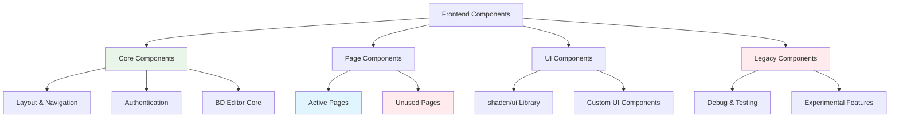
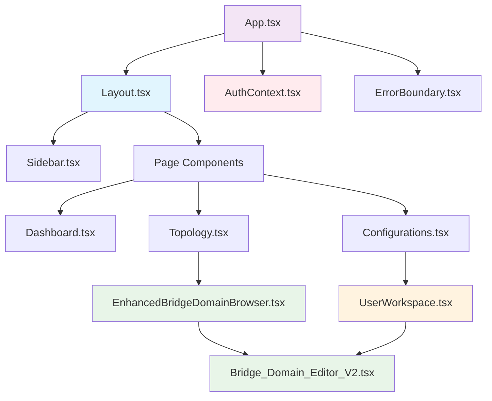

# 🧩 Component Inventory
## 📊 **COMPONENT REGISTRY & OWNERSHIP TRACKING**

---

## 🎯 **COMPONENT CLASSIFICATION SYSTEM**

### **📊 COMPONENT CATEGORIES:**


---

## 🟢 **CORE COMPONENTS (Keep & Enhance)**

### **🏗️ Layout & Navigation Components:**
```
LAYOUT SYSTEM:
├── 📱 Layout.tsx
│   ├── Purpose: Main application shell with sidebar
│   ├── Used By: All authenticated pages
│   ├── Status: ✅ Active, Essential
│   ├── Size: ~150 lines
│   ├── Dependencies: Sidebar, ProtectedRoute
│   ├── Enhancement: 🎨 Professional polish needed
│   └── Ownership: Core infrastructure
│
├── 📋 Sidebar.tsx
│   ├── Purpose: Primary navigation menu
│   ├── Used By: Layout.tsx
│   ├── Status: ✅ Active, Essential
│   ├── Size: ~100 lines
│   ├── Dependencies: Lucide icons, shadcn/ui
│   ├── Enhancement: 🎨 Visual design improvement
│   └── Ownership: Navigation system
│
├── 🛡️ ProtectedRoute.tsx
│   ├── Purpose: Authentication guard for routes
│   ├── Used By: App routing system
│   ├── Status: ✅ Active, Essential
│   ├── Size: ~50 lines
│   ├── Dependencies: AuthContext
│   ├── Enhancement: ✅ No changes needed
│   └── Ownership: Security system
│
└── 🚨 ErrorBoundary.tsx
    ├── Purpose: Error catching and display
    ├── Used By: App wrapper
    ├── Status: ✅ Active, Essential
    ├── Size: ~80 lines
    ├── Dependencies: React error boundaries
    ├── Enhancement: 🎨 Better error UI
    └── Ownership: Error handling system
```

### **🔑 Authentication Components:**
```
AUTH SYSTEM:
├── 🔐 AuthContext.tsx
│   ├── Purpose: User authentication state management
│   ├── Used By: All components requiring auth
│   ├── Status: ✅ Active, Critical
│   ├── Size: ~200 lines
│   ├── Dependencies: React Context, JWT handling
│   ├── Enhancement: ✅ Functional, minor polish
│   └── Ownership: Authentication system
│
└── 🔑 Login.tsx (Page)
    ├── Purpose: User login interface
    ├── Used By: Unauthenticated users
    ├── Status: ✅ Active, Essential
    ├── Size: ~150 lines
    ├── Dependencies: AuthContext, form handling
    ├── Enhancement: 🎨 Professional login design
    └── Ownership: Authentication UI
```

### **🔧 BD Editor Core Components:**
```
BD EDITOR SYSTEM:
├── 🔍 EnhancedBridgeDomainBrowser.tsx
│   ├── Purpose: Main BD browsing and assignment interface
│   ├── Used By: Topology.tsx (BD Browser page)
│   ├── Status: ✅ Active, Critical
│   ├── Size: ~800 lines
│   ├── Dependencies: Table, Modal, API integration
│   ├── Enhancement: 🎨 Major UI redesign needed
│   ├── Features: 524 BD browsing, assignment, raw config
│   └── Ownership: BD Editor core functionality
│
├── 👤 UserWorkspace.tsx
│   ├── Purpose: Personal workspace for assigned BDs
│   ├── Used By: Configurations.tsx (My Workspace tab)
│   ├── Status: ✅ Active, Critical
│   ├── Size: ~300 lines
│   ├── Dependencies: Card layouts, API integration
│   ├── Enhancement: 🎨 Major dashboard redesign needed
│   ├── Features: Assignment management, exclusive editing
│   └── Ownership: User workspace system
│
└── ✏️ Bridge_Domain_Editor_V2.tsx
    ├── Purpose: BD editing modal with interface management
    ├── Used By: EnhancedBridgeDomainBrowser, UserWorkspace
    ├── Status: ✅ Active, Critical
    ├── Size: ~800 lines
    ├── Dependencies: Form handling, validation, modal
    ├── Enhancement: 🎨 Major modal redesign needed
    ├── Features: Interface editing, DNAAS-type awareness
    └── Ownership: BD Editor editing functionality
```

---

## 📱 **PAGE COMPONENTS (Active)**

### **✅ ACTIVE PAGES (Keep & Enhance):**
```
ACTIVE PAGE INVENTORY:
├── 📊 Dashboard.tsx
│   ├── Route: "/"
│   ├── Purpose: System overview and quick actions
│   ├── Status: ✅ Active, Important
│   ├── Size: ~220 lines
│   ├── Components Used: UserInfoWidget, statistics cards
│   ├── Enhancement: 🎨 Remove placeholder data, real metrics
│   ├── Cleanup Target: Remove debug output, placeholder deployments
│   └── Ownership: System overview
│
├── 🔍 Topology.tsx
│   ├── Route: "/topology"
│   ├── Purpose: BD Browser page with discovery integration
│   ├── Status: ✅ Active, Critical
│   ├── Size: ~400 lines
│   ├── Components Used: EnhancedBridgeDomainBrowser
│   ├── Enhancement: 🎨 Integrate discovery + browser better
│   ├── Cleanup Target: Legacy topology visualization code
│   └── Ownership: BD discovery and browsing
│
├── 📋 Configurations.tsx
│   ├── Route: "/configurations"
│   ├── Purpose: User workspace with tab integration
│   ├── Status: ✅ Active, Critical
│   ├── Size: 3,528 lines (NEEDS MAJOR CLEANUP)
│   ├── Components Used: UserWorkspace, BridgeDomainEditorV2
│   ├── Enhancement: 🧹 Remove 2,000+ lines of legacy code
│   ├── Cleanup Target: Demo sections, import wizards, debug code
│   └── Ownership: User workspace integration
│
├── 🔑 Login.tsx
│   ├── Route: "/login"
│   ├── Purpose: User authentication interface
│   ├── Status: ✅ Active, Essential
│   ├── Size: ~100 lines
│   ├── Components Used: Form components, AuthContext
│   ├── Enhancement: 🎨 Professional login design
│   ├── Cleanup Target: None (clean component)
│   └── Ownership: Authentication UI
│
└── ❌ NotFound.tsx
    ├── Route: "/*"
    ├── Purpose: 404 error page
    ├── Status: ✅ Active, Utility
    ├── Size: ~50 lines
    ├── Components Used: Basic layout
    ├── Enhancement: 🎨 Better error page design
    ├── Cleanup Target: None (simple component)
    └── Ownership: Error handling UI
```

---

## 🔴 **LEGACY COMPONENTS (Remove)**

### **🧪 DEBUG & TESTING COMPONENTS:**
```
DEBUG COMPONENTS (REMOVE):
├── ❌ DebugWindow.tsx
│   ├── Purpose: Development debugging interface
│   ├── Used By: Configurations.tsx (testing)
│   ├── Status: ❌ Legacy, Remove
│   ├── Size: ~150 lines
│   ├── Removal Impact: Zero (debug only)
│   ├── Dependencies: Dialog, ScrollArea
│   └── Removal Priority: 🔥 High (safe removal)
│
├── ❌ DataChainVisualization.tsx
│   ├── Purpose: Experimental data visualization
│   ├── Used By: None (experimental)
│   ├── Status: ❌ Experimental, Remove
│   ├── Size: ~300 lines
│   ├── Removal Impact: Zero (not integrated)
│   ├── Dependencies: Complex visualization libraries
│   └── Removal Priority: 🔥 High (safe removal)
│
└── ❌ TopologyCanvas.tsx
    ├── Purpose: Canvas-based topology rendering
    ├── Used By: None (experimental)
    ├── Status: ❌ Experimental, Remove
    ├── Size: ~400 lines
    ├── Removal Impact: Zero (not used)
    ├── Dependencies: Canvas API, complex rendering
    └── Removal Priority: 🔥 High (safe removal)
```

### **📱 UNUSED PAGE COMPONENTS:**
```
UNUSED PAGES (REMOVE):
├── ✅ BridgeBuilder.tsx
│   ├── Purpose: Create new bridge domains from scratch
│   ├── Route: "/builder"
│   ├── Status: ✅ Active, Essential (Different from BD Editor)
│   ├── Size: 1,200+ lines
│   ├── Function: NEW BD creation (vs BD Editor = EXISTING BD editing)
│   ├── Dependencies: Complex form handling, device APIs
│   └── Priority: ✅ Keep (Essential for new BD workflow)
│
├── ❌ Deployments.tsx
│   ├── Purpose: Standalone deployment interface
│   ├── Route: "/deployments"
│   ├── Status: ❌ Not integrated with BD Editor
│   ├── Size: ~300 lines
│   ├── Removal Impact: Route cleanup needed
│   ├── Dependencies: Deployment APIs (not connected)
│   └── Removal Priority: 🔥 High (safe removal)
│
├── ❌ Files.tsx
│   ├── Purpose: File management interface
│   ├── Route: "/files"
│   ├── Status: ❌ Not used in BD Editor workflow
│   ├── Size: ~200 lines
│   ├── Removal Impact: Route cleanup needed
│   ├── Dependencies: File upload APIs
│   └── Removal Priority: 🔥 High (safe removal)
│
├── ❌ UserManagement.tsx
│   ├── Purpose: Admin user management interface
│   ├── Route: "/users"
│   ├── Status: ❌ Admin only, not integrated
│   ├── Size: ~400 lines
│   ├── Removal Impact: Route cleanup needed
│   ├── Dependencies: User management APIs
│   └── Removal Priority: 🟡 Medium (admin functionality)
│
└── ❌ Index.tsx
    ├── Purpose: Simple redirect to dashboard
    ├── Route: "/index"
    ├── Status: ❌ Redundant (App.tsx handles redirect)
    ├── Size: ~30 lines
    ├── Removal Impact: Minimal
    ├── Dependencies: React Router
    └── Removal Priority: 🔥 High (safe removal)
```

### **🔧 REDUNDANT UTILITY COMPONENTS:**
```
REDUNDANT UTILITIES (REMOVE):
├── ❌ SmartDeploymentWizard.tsx
│   ├── Purpose: Deployment wizard interface
│   ├── Used By: Configurations.tsx (legacy)
│   ├── Status: ❌ Superseded by BD Editor deployment
│   ├── Size: ~200 lines
│   ├── Removal Impact: Remove from Configurations.tsx
│   ├── Dependencies: Wizard pattern, deployment APIs
│   └── Removal Priority: 🔥 High (replaced functionality)
│
├── ❌ TopologyComparisonView.tsx
│   ├── Purpose: Topology comparison interface
│   ├── Used By: None (experimental)
│   ├── Status: ❌ Experimental, not integrated
│   ├── Size: ~250 lines
│   ├── Removal Impact: Zero (not used)
│   ├── Dependencies: Comparison algorithms
│   └── Removal Priority: 🔥 High (safe removal)
│
├── ❌ Header.tsx
│   ├── Purpose: Standalone header component
│   ├── Used By: None (Layout.tsx handles header)
│   ├── Status: ❌ Redundant with Layout.tsx
│   ├── Size: ~80 lines
│   ├── Removal Impact: Zero (not used)
│   ├── Dependencies: Basic UI components
│   └── Removal Priority: 🔥 High (safe removal)
│
└── ❌ UserInfoWidget.tsx
    ├── Purpose: User information display
    ├── Used By: Dashboard.tsx
    ├── Status: ❌ Redundant with AuthContext
    ├── Size: ~100 lines
    ├── Removal Impact: Update Dashboard.tsx
    ├── Dependencies: AuthContext, user data
    └── Removal Priority: 🟡 Medium (replace with AuthContext)
```

---

## 📊 **COMPONENT DEPENDENCY MATRIX**

### **🔗 DEPENDENCY RELATIONSHIPS:**


### **📊 COMPONENT USAGE MATRIX:**
```
COMPONENT USAGE TRACKING:
┌─────────────────────────────┬─────────────┬─────────────┬─────────────┬─────────────┐
│ Component                   │ Used By     │ Usage Count │ Critical    │ Action      │
├─────────────────────────────┼─────────────┼─────────────┼─────────────┼─────────────┤
│ Layout.tsx                  │ All pages   │ 5 pages     │ ✅ Critical │ ✅ Keep     │
│ Sidebar.tsx                 │ Layout      │ 1 component │ ✅ Critical │ ✅ Keep     │
│ AuthContext.tsx             │ All auth    │ 6 components│ ✅ Critical │ ✅ Keep     │
│ EnhancedBridgeDomainBrowser │ Topology    │ 1 page      │ ✅ Critical │ ✅ Keep     │
│ UserWorkspace.tsx           │ Config page │ 1 tab       │ ✅ Critical │ ✅ Keep     │
│ Bridge_Domain_Editor_V2     │ 2 components│ 2 parents   │ ✅ Critical │ ✅ Keep     │
│ DebugWindow.tsx             │ None        │ 0 active    │ ❌ Debug    │ ❌ Remove   │
│ SmartDeploymentWizard       │ Legacy only │ 1 legacy    │ ❌ Legacy   │ ❌ Remove   │
│ BridgeBuilder.tsx           │ Route only  │ 1 route     │ ❌ Legacy   │ ❌ Remove   │
│ DataChainVisualization      │ None        │ 0 active    │ ❌ Experiment│ ❌ Remove  │
└─────────────────────────────┴─────────────┴─────────────┴─────────────┴─────────────┘
```

---

## 🎨 **UI COMPONENT LIBRARY**

### **📚 shadcn/ui Components (Keep):**
```
UI LIBRARY COMPONENTS (45 components):
├── ✅ ACTIVELY USED (Keep):
│   ├── Button, Card, Badge, Table, Dialog, Alert
│   ├── Input, Select, Tabs, Progress, ScrollArea
│   ├── Collapsible, Separator, Skeleton, Toast
│   └── Form components, Layout components
│
├── 🟡 OCCASIONALLY USED (Keep):
│   ├── Accordion, Calendar, Chart, Drawer
│   ├── Hover-card, Menubar, Pagination, Popover
│   ├── Radio-group, Slider, Switch, Textarea
│   └── Toggle, Tooltip, Command, Context-menu
│
└── ❌ UNUSED (Consider Removing):
    ├── Aspect-ratio, Avatar, Breadcrumb, Carousel
    ├── Checkbox, Input-otp, Navigation-menu, Resizable
    └── Toggle-group (check if actually unused)
```

### **🔧 CUSTOM UI COMPONENTS:**
```
CUSTOM COMPONENTS:
├── ✅ searchable-select.tsx
│   ├── Purpose: Enhanced select with search functionality
│   ├── Used By: Forms requiring searchable dropdowns
│   ├── Status: ✅ Active, Useful
│   ├── Size: ~100 lines
│   └── Ownership: Custom UI enhancement
│
└── 📊 Component Enhancement Targets:
    ├── Professional table design for BD Browser
    ├── Enhanced card layouts for User Workspace
    ├── Improved modal design for BD Editor
    └── Better form components for assignment workflow
```

---

## 🧹 **CLEANUP EXECUTION PLAN**

### **📋 PHASE 1: SAFE REMOVALS (Zero Dependencies)**
```
REMOVE FIRST (No Impact):
├── ❌ DebugWindow.tsx (0 dependencies)
├── ❌ DataChainVisualization.tsx (0 dependencies)
├── ❌ TopologyCanvas.tsx (0 dependencies)
├── ❌ TopologyComparisonView.tsx (0 dependencies)
├── ❌ Header.tsx (0 dependencies)
└── ❌ Index.tsx (simple redirect)

ESTIMATED REDUCTION: ~1,000 lines removed
```

### **📋 PHASE 2: PAGE REMOVALS (Route Updates Needed)**
```
REMOVE SECOND (Update App.tsx routing):
├── ❌ BridgeBuilder.tsx (remove "/builder" route)
├── ❌ Deployments.tsx (remove "/deployments" route)
├── ❌ Files.tsx (remove "/files" route)
├── ❌ UserManagement.tsx (remove "/users" route)
└── Update App.tsx to remove unused routes

ESTIMATED REDUCTION: ~2,100 lines removed
```

### **📋 PHASE 3: COMPONENT CLEANUP (Careful Removal)**
```
CLEAN THIRD (Update Dependencies):
├── 🧹 Configurations.tsx: Remove demo sections (3,528 → 1,500 lines)
├── 🧹 Dashboard.tsx: Remove placeholder data (220 → 150 lines)
├── ❌ SmartDeploymentWizard.tsx: Remove and update references
├── ❌ UserInfoWidget.tsx: Replace with AuthContext usage
└── 🧹 Remove console.log statements throughout

ESTIMATED REDUCTION: ~2,500 lines cleaned
```

---

## 📊 **COMPONENT ENHANCEMENT PRIORITIES**

### **🎨 ENHANCEMENT MATRIX:**
```
COMPONENT ENHANCEMENT PRIORITIES:
┌─────────────────────────────┬─────────────┬─────────────┬─────────────┬─────────────┐
│ Component                   │ Current     │ Target      │ Effort      │ Priority    │
├─────────────────────────────┼─────────────┼─────────────┼─────────────┼─────────────┤
│ EnhancedBridgeDomainBrowser │ 🟡 Basic    │ 🎨 Pro      │ 🔥 High     │ 🔥 Critical │
│ UserWorkspace.tsx           │ 🟡 Basic    │ 🎨 Pro      │ 🔥 High     │ 🔥 Critical │
│ Bridge_Domain_Editor_V2     │ 🟡 Basic    │ 🎨 Pro      │ 🔥 High     │ 🔥 Critical │
│ Dashboard.tsx               │ 🟡 Basic    │ 🎨 Polish   │ 🟡 Medium   │ 🟡 Medium   │
│ Login.tsx                   │ ✅ OK       │ 🎨 Polish   │ 🟢 Low      │ 🟢 Low      │
│ Layout.tsx                  │ ✅ OK       │ 🎨 Polish   │ 🟡 Medium   │ 🟡 Medium   │
│ Sidebar.tsx                 │ ✅ OK       │ 🎨 Polish   │ 🟡 Medium   │ 🟡 Medium   │
└─────────────────────────────┴─────────────┴─────────────┴─────────────┴─────────────┘

LEGEND:
├── 🟡 Basic: Functional but needs visual enhancement
├── ✅ OK: Good quality, minor polish needed
├── 🎨 Pro: Professional, enterprise-ready design
├── 🎨 Polish: Minor visual improvements
└── Priority: 🔥 Critical, 🟡 Medium, 🟢 Low
```

---

## 🔄 **COMPONENT LIFECYCLE TRACKING**

### **📊 COMPONENT STATUS TRACKING:**
```
COMPONENT LIFECYCLE:
├── 🆕 New: Recently created, needs stabilization
├── ✅ Active: Stable, in production use
├── 🔄 Evolving: Active development, frequent changes
├── 🟡 Maintenance: Stable, occasional updates
├── ❌ Deprecated: Marked for removal
└── 🗑️ Removed: Deleted from codebase

CURRENT STATUS DISTRIBUTION:
├── ✅ Active: 8 components (core BD Editor functionality)
├── 🔄 Evolving: 3 components (EnhancedBDBrowser, UserWorkspace, BDEditor)
├── 🟡 Maintenance: 4 components (Layout, Auth, Dashboard, Login)
├── ❌ Deprecated: 8 components (legacy/debug/unused)
└── 🗑️ Removed: 0 components (cleanup pending)
```

### **🎯 COMPONENT OWNERSHIP:**
```
OWNERSHIP ASSIGNMENT:
├── 🔧 Core Infrastructure: Layout, Auth, ErrorBoundary, ProtectedRoute
├── 🔍 BD Discovery: EnhancedBridgeDomainBrowser, Topology page
├── 👤 User Workspace: UserWorkspace, Configurations page integration
├── ✏️ BD Editor: Bridge_Domain_Editor_V2, editing workflow
├── 📊 System Overview: Dashboard, statistics, quick actions
└── 🗑️ Legacy Cleanup: All deprecated components marked for removal
```

---

## 🚀 **COMPONENT ROADMAP**

### **📋 IMMEDIATE ACTIONS (Phase 1):**
1. **🗑️ Remove unused components** (DebugWindow, DataChain, TopologyCanvas, etc.)
2. **🧹 Clean Configurations.tsx** (remove 2,000+ lines of legacy code)
3. **🔄 Update routing** (remove unused page routes)
4. **📊 Update dependencies** (remove unused imports)

### **🎨 ENHANCEMENT ACTIONS (Phase 2):**
1. **🎨 Enhance BD Browser** (professional table design)
2. **🎨 Enhance User Workspace** (dashboard layout improvement)
3. **🎨 Enhance BD Editor Modal** (tabbed interface design)
4. **🎨 Polish Dashboard** (real metrics, better layout)

### **🚀 ADVANCED FEATURES (Phase 3):**
1. **📱 Mobile optimization** (responsive component variants)
2. **♿ Accessibility enhancement** (ARIA labels, keyboard nav)
3. **⚡ Performance optimization** (lazy loading, virtualization)
4. **🎯 Advanced interactions** (drag-and-drop, keyboard shortcuts)

**This component inventory provides a complete map of the frontend architecture and systematic cleanup plan!** 🎯
