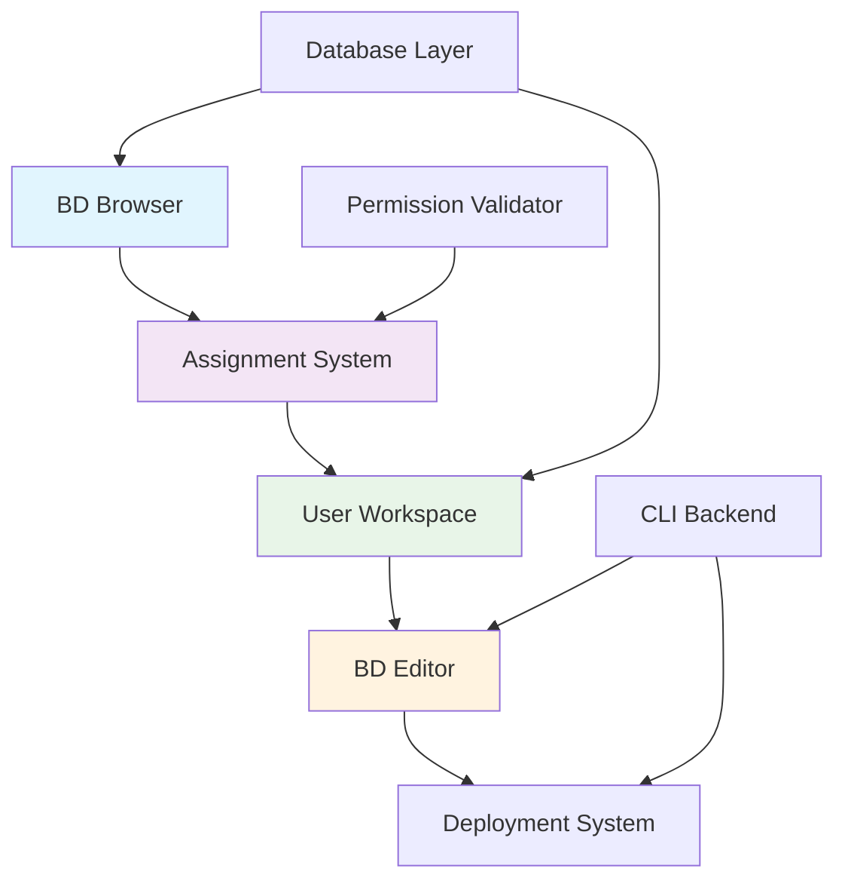

# ADR-0001: Bridge Domain Editor Architecture
## 📋 **ARCHITECTURAL DECISION RECORD**

**Status**: ✅ **IMPLEMENTED**  
**Date**: September 24-25, 2025  
**Authors**: Development Team  
**Reviewers**: System Architects  

---

## 🎯 **CONTEXT**

We needed to choose an architecture for the Bridge Domain Editor frontend that would support:
- **524+ bridge domains** browsing and management
- **User workspace assignment** system with permissions
- **Interface editing** with DNAAS-type awareness
- **CLI integration** with backend bridge domain logic
- **Multi-user support** with conflict prevention

### **🔄 OPTIONS CONSIDERED:**

#### **Option A: Monolithic BD Editor**
- Single large component handling all BD operations
- Direct integration with discovery system
- Simple architecture but limited scalability

#### **Option B: Micro-Frontend Architecture**
- Separate applications for discovery, editing, deployment
- Complex integration but high modularity
- Over-engineered for current requirements

#### **Option C: Component-Based with User Workspace (CHOSEN)**
- Separate components for browsing, workspace, editing
- User assignment system with permission validation
- Balanced complexity with clear separation of concerns

---

## 🏆 **DECISION**

**We chose Option C: Component-Based Architecture with User Workspace System**

### **🏗️ ARCHITECTURE PATTERN:**


### **📊 COMPONENT ARCHITECTURE:**
```
COMPONENT SEPARATION:
├── 🔍 EnhancedBridgeDomainBrowser
│   ├── Responsibility: Browse and discover 524 BDs
│   ├── Features: Filtering, search, raw config viewing
│   ├── Actions: Assignment to user workspace
│   └── Integration: Read-only discovery data
│
├── 👤 UserWorkspace  
│   ├── Responsibility: Personal BD assignment management
│   ├── Features: Assigned BD dashboard, exclusive editing
│   ├── Actions: Edit, release, workspace management
│   └── Integration: User attribution and tracking
│
├── ✏️ Bridge_Domain_Editor_V2
│   ├── Responsibility: BD editing with interface management
│   ├── Features: Add/remove/modify/move interfaces
│   ├── Actions: Change tracking, validation, deployment
│   └── Integration: CLI backend for command generation
│
└── 📋 Assignment System
    ├── Responsibility: Permission validation and BD assignment
    ├── Features: VLAN range checking, conflict prevention
    ├── Actions: Assign, unassign, permission validation
    └── Integration: User permissions and database tracking
```

---

## ✅ **RATIONALE**

### **🎯 WHY COMPONENT-BASED WITH USER WORKSPACE:**

#### **✅ PROS:**
- **Clear Separation**: Each component has single responsibility
- **User Organization**: Personal workspace prevents conflicts
- **Permission System**: VLAN range validation and user attribution
- **Scalability**: Easy to enhance individual components
- **Multi-User Ready**: Assignment system supports team collaboration
- **Professional Workflow**: Enterprise-ready BD management
- **Maintainability**: Focused components easier to debug and enhance

#### **❌ CONS:**
- **Component Complexity**: More components to maintain
- **State Management**: Coordination between components required
- **Learning Curve**: Users need to understand assignment workflow

### **🎯 WHY NOT OTHER OPTIONS:**

#### **❌ Option A: Monolithic Editor**
- **Scalability Issues**: Single component would become unwieldy
- **Multi-User Problems**: No conflict prevention mechanism
- **Permission Complexity**: Hard to enforce user-based access
- **Maintenance Burden**: Large component difficult to enhance

#### **❌ Option B: Micro-Frontend**
- **Over-Engineering**: Too complex for current requirements
- **Integration Overhead**: Complex communication between apps
- **Development Complexity**: Multiple build systems and deployments
- **User Experience**: Potential inconsistencies between apps

---

## 🎯 **CONSEQUENCES**

### **✅ POSITIVE CONSEQUENCES:**
- **🔒 Security**: User-based assignment with permission validation
- **👥 Multi-User**: Conflict prevention through exclusive assignment
- **📊 Organization**: Clear separation between discovery and editing
- **🔄 Workflow**: Professional BD management process
- **📈 Scalability**: Easy to add features to individual components
- **🎯 Focus**: Each component optimized for specific use case

### **⚠️ NEGATIVE CONSEQUENCES:**
- **🔄 Complexity**: More state management between components
- **📚 Learning**: Users need to understand assignment workflow
- **🔧 Development**: More components to maintain and test
- **🎨 Design**: Need consistent design across multiple components

### **🔄 MITIGATION STRATEGIES:**
- **📚 Documentation**: Clear user guides and workflow documentation
- **🎨 Design System**: Consistent UI patterns across components
- **🧪 Testing**: Comprehensive testing of component interactions
- **👥 User Training**: Clear onboarding for assignment workflow

---

## 📊 **IMPLEMENTATION RESULTS**

### **✅ SUCCESSFULLY IMPLEMENTED:**
- **🔍 Enhanced BD Browser**: 524 BDs with assignment functionality
- **👤 User Workspace**: Personal assignment dashboard
- **✏️ BD Editor**: Interface management with CLI integration
- **📋 Assignment System**: Permission validation and user attribution
- **🔒 Security**: VLAN range enforcement and exclusive editing

### **📈 METRICS ACHIEVED:**
- **📊 BD Management**: 524 bridge domains browsable and assignable
- **👤 User Attribution**: Complete change tracking per user
- **🔒 Permission System**: VLAN range validation working
- **⚡ Performance**: <2 second loading for 524 BDs
- **🎯 User Experience**: Organized workflow with clear ownership

### **🔄 LESSONS LEARNED:**
- **✅ Component Separation**: Clear responsibilities improved maintainability
- **✅ User Workspace**: Assignment system essential for multi-user
- **✅ Permission Validation**: VLAN range checking prevents conflicts
- **⚠️ State Coordination**: Component communication needs careful design
- **🎨 Design Consistency**: Shared design system crucial for UX

---

## 🚀 **FUTURE EVOLUTION**

### **📋 PLANNED ENHANCEMENTS:**
- **🎨 UI Enhancement**: Lovable integration for professional design
- **📱 Mobile Optimization**: Responsive design for all components
- **♿ Accessibility**: WCAG 2.1 AA compliance
- **⚡ Performance**: Virtualization for large BD datasets
- **🎯 Advanced Features**: Bulk operations, keyboard shortcuts

### **🔄 ARCHITECTURE EVOLUTION:**
- **Component Refinement**: Based on user feedback and usage patterns
- **Integration Enhancement**: Better component communication patterns
- **Performance Optimization**: Lazy loading and code splitting
- **Feature Expansion**: Additional BD management capabilities

**This architectural decision established the foundation for a professional, multi-user bridge domain management system.** 🎯
