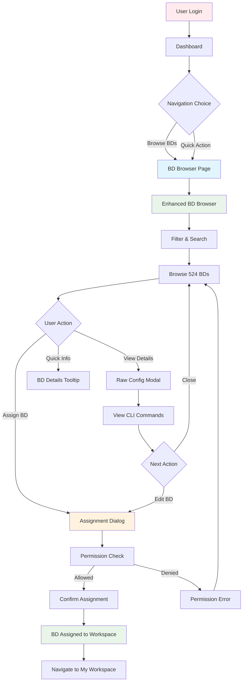

# 🔍 Bridge Domain Discovery Flow
## 🎯 **USER JOURNEY: DISCOVERY TO ASSIGNMENT**

---

## 🌊 **COMPLETE DISCOVERY FLOW**

### **📊 FLOW OVERVIEW:**


---

## 🔍 **DETAILED FLOW BREAKDOWN**

### **📱 STEP 1: ENTRY POINTS**
```
DISCOVERY ENTRY POINTS:
├── 🏠 Dashboard → [Browse BDs] button → BD Browser
├── 📋 Sidebar → "BD Browser" link → BD Browser  
├── 🔗 Direct URL → /topology → BD Browser
└── 🚀 Quick Action → Dashboard shortcut → BD Browser

ENTRY POINT ANALYTICS:
├── Primary: Sidebar navigation (expected: 60%)
├── Secondary: Dashboard quick action (expected: 30%)
├── Direct: URL navigation (expected: 8%)
└── Other: Deep links, bookmarks (expected: 2%)
```

### **📊 STEP 2: BD BROWSER INTERFACE**
```
BD BROWSER INTERACTION FLOW:
┌─────────────────────────────────────────────────────────────┐
│ 🔍 BD Browser Landing                                      │
│ ├── 📊 Statistics Dashboard (524 total, 514 available)     │
│ ├── 🔍 Filter Interface (search, DNAAS type, source)       │
│ ├── 📋 BD Table (paginated, sortable, 20 per page)         │
│ └── 🎯 Action Buttons (assign, view, info)                 │
└─────────────────────────────────────────────────────────────┘

USER INTERACTION PATTERNS:
├── 📊 Scan Statistics → Understand system state
├── 🔍 Apply Filters → Narrow down relevant BDs
├── 📋 Browse Table → Examine individual BDs
├── 👁️ View Raw Config → Understand current configuration
├── 📋 Assign BD → Claim for personal editing
└── ℹ️ Get Quick Info → Tooltip details on hover
```

### **🔍 STEP 3: FILTERING & SEARCH**
```
FILTERING WORKFLOW:
┌─────────────────────────────────────────────────────────────┐
│ 🔍 FILTER INTERFACE                                        │
│ ┌─────────────────────────────────────────────────────────┐ │
│ │ [Search: "visaev"     ] [Source: All ▼] [Type: 4A ▼]  │ │
│ │ [VLAN Range: 100-300  ] [Status: Available ▼] [Apply] │ │
│ └─────────────────────────────────────────────────────────┘ │
│ ┌─────────────────────────────────────────────────────────┐ │
│ │ 📊 Filter Results: 15 of 524 bridge domains            │ │
│ │ 🔍 Active Filters: [visaev ✕] [4A_SINGLE ✕] [Clear]   │ │
│ └─────────────────────────────────────────────────────────┘ │
└─────────────────────────────────────────────────────────────┘

FILTER CAPABILITIES:
├── 🔤 Text Search: Name, username, VLAN ID
├── 🏷️ DNAAS Type: 2A_QINQ, 4A_SINGLE, 1_DOUBLE, etc.
├── 📊 Source Type: Discovered vs User Created
├── 🔢 VLAN Range: Numeric range filtering
├── 📋 Assignment Status: Available, Assigned, Assigned to You
└── 🔄 Quick Filters: Preset filter combinations
```

### **👁️ STEP 4: RAW CONFIG VIEWING**
```
RAW CONFIG MODAL FLOW:
┌─────────────────────────────────────────────────────────────┐
│ 📜 Raw CLI Configuration - g_visaev_v251                   │
│ ┌─────────────────────────────────────────────────────────┐ │
│ │ ⚠️ DNAAS Type: 4A_SINGLE │ Endpoints: 3 user-editable  │ │
│ │ 💡 Infrastructure interfaces hidden (auto-managed)     │ │
│ └─────────────────────────────────────────────────────────┘ │
│ ┌─────────────────────────────────────────────────────────┐ │
│ │ 📱 DNAAS-LEAF-B15:ge100-0/0/5.251                      │ │
│ │ [VLAN 251] [access] [subinterface]                     │ │
│ │ ┌─────────────────────────────────────────────────────┐ │ │
│ │ │ 📜 Raw CLI:                                         │ │ │
│ │ │ 1. interfaces ge100-0/0/5.251 l2-service enabled   │ │ │
│ │ │ 2. interfaces ge100-0/0/5.251 vlan-id 251          │ │ │
│ │ └─────────────────────────────────────────────────────┘ │ │
│ └─────────────────────────────────────────────────────────┘ │
│ [❌ Close] [✏️ Edit Bridge Domain]                          │
└─────────────────────────────────────────────────────────────┘

RAW CONFIG FEATURES:
├── 📱 Device Organization: Group interfaces by device
├── 🏷️ Badge System: VLAN, role, type indicators
├── 📜 CLI Highlighting: Syntax-highlighted commands
├── 🔍 Context Info: DNAAS type and endpoint count
└── ⚡ Quick Edit: Direct access to BD Editor
```

### **📋 STEP 5: ASSIGNMENT WORKFLOW**
```mermaid
flowchart TD
    A[Click "Assign to Workspace"] --> B[Permission Check]
    
    B -->|Allowed| C[Assignment Dialog]
    B -->|Denied| D[Permission Error]
    
    C --> E[Show BD Details]
    E --> F[Assignment Effects Warning]
    F --> G{User Confirmation}
    
    G -->|Confirm| H[API Assignment Call]
    G -->|Cancel| I[Return to Browser]
    
    H -->|Success| J[Assignment Success]
    H -->|Error| K[Assignment Error]
    
    J --> L[Update BD Status]
    L --> M[Navigate to Workspace]
    
    K --> I
    D --> I
    
    style C fill:#e8f5e8
    style J fill:#e8f5e8
    style D fill:#ffebee
    style K fill:#ffebee
```

### **📋 ASSIGNMENT DIALOG DETAILS:**
```
ASSIGNMENT CONFIRMATION DIALOG:
┌─────────────────────────────────────────────────────────────┐
│ 📋 Assign to Workspace                              [✕]    │
├─────────────────────────────────────────────────────────────┤
│ Assign g_visaev_v251 to your personal workspace for editing │
├─────────────────────────────────────────────────────────────┤
│ ┌─────────────────────────────────────────────────────────┐ │
│ │ 📊 Bridge Domain Details                                │ │
│ │ Name: g_visaev_v251                                     │ │
│ │ VLAN: 251                                               │ │
│ │ Original User: visaev                                   │ │
│ │ DNAAS Type: 4A_SINGLE                                   │ │
│ │ Endpoints: 3 user-editable                             │ │
│ └─────────────────────────────────────────────────────────┘ │
├─────────────────────────────────────────────────────────────┤
│ ⚠️ Assignment Effects:                                       │
│ • Bridge domain will be added to your workspace            │
│ • Only you will be able to edit this bridge domain         │
│ • All changes will be tracked and attributed to you        │
│ • You can release it back to available pool anytime        │
├─────────────────────────────────────────────────────────────┤
│                                    [Cancel] [📋 Assign]     │
└─────────────────────────────────────────────────────────────┘

DIALOG FEATURES:
├── 📊 BD Context: Complete bridge domain information
├── ⚠️ Effect Warning: Clear explanation of assignment impact
├── 🔒 Permission Info: VLAN range validation feedback
├── ✅ Confirmation: Explicit user consent required
└── 🎯 Clear Actions: Cancel vs Assign with visual distinction
```

---

## 📊 **FLOW METRICS & OPTIMIZATION**

### **⏱️ PERFORMANCE TARGETS:**
```
DISCOVERY FLOW PERFORMANCE:
├── Page Load: BD Browser in <2 seconds
├── Filter Response: <100ms for real-time filtering
├── Table Rendering: 524 BDs in <1 second
├── Modal Opening: Raw config in <300ms
├── Assignment Action: <500ms including validation
└── Navigation: Page transitions in <200ms
```

### **👤 USER EXPERIENCE METRICS:**
```
UX SUCCESS CRITERIA:
├── 🎯 BD Discovery: Find relevant BD in <30 seconds
├── 📋 Assignment: Complete assignment in <60 seconds
├── 🔍 Raw Config: Access CLI commands in <10 seconds
├── 📊 Filter Usage: Apply filters in <15 seconds
└── 🔄 Workflow: Complete discovery→assignment in <2 minutes
```

### **🔄 FLOW OPTIMIZATION OPPORTUNITIES:**
```
OPTIMIZATION TARGETS:
├── 🚀 Keyboard Shortcuts: Power user navigation
├── 🔍 Smart Search: Auto-complete and suggestions
├── 📊 Bulk Operations: Multi-BD assignment
├── 🎯 Quick Filters: One-click filter presets
├── 📱 Mobile Optimization: Touch-friendly interactions
└── ♿ Accessibility: Screen reader and keyboard navigation
```

**This discovery flow documentation provides a complete map of the user journey from authentication to bridge domain assignment!** 🎯
