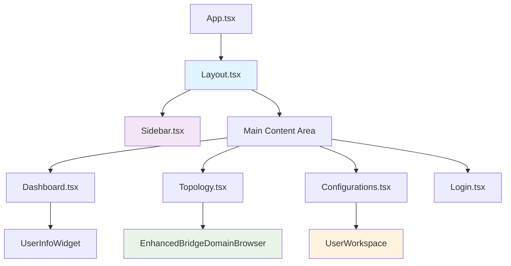
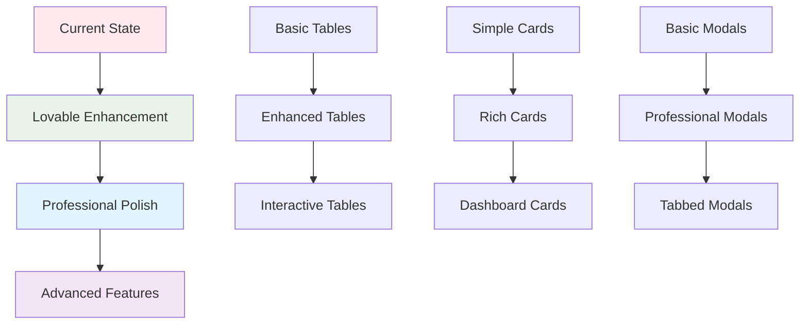

# 📐 Layouts Matrix
## 🎨 **LAYOUT SYSTEM & PAGE ASSIGNMENTS**

---

## 🏗️ **LAYOUT ARCHITECTURE**

### **📊 LAYOUT HIERARCHY:**


### **🎯 LAYOUT COMPONENTS:**
```
LAYOUT COMPONENT MATRIX:
┌─────────────────┬─────────────┬─────────────┬─────────────┬─────────────┐
│ Component       │ Purpose     │ Used By     │ Responsive  │ Status      │
├─────────────────┼─────────────┼─────────────┼─────────────┼─────────────┤
│ Layout.tsx      │ Main shell  │ All pages   │ ✅ Yes      │ ✅ Active   │
│ Sidebar.tsx     │ Navigation  │ Layout      │ ✅ Collaps. │ ✅ Active   │
│ ProtectedRoute  │ Auth guard  │ App routing │ ✅ Yes      │ ✅ Active   │
│ ErrorBoundary   │ Error catch │ App wrapper │ ✅ Yes      │ ✅ Active   │
│ Header.tsx      │ Page header │ None        │ ❌ No       │ ❌ Remove   │
└─────────────────┴─────────────┴─────────────┴─────────────┴─────────────┘
```

---

## 📱 **RESPONSIVE LAYOUT SYSTEM**

### **📊 BREAKPOINT MATRIX:**
```
RESPONSIVE BREAKPOINTS:
┌─────────────────┬─────────────┬─────────────┬─────────────┬─────────────┐
│ Screen Size     │ Width       │ Sidebar     │ Content     │ BD Table    │
├─────────────────┼─────────────┼─────────────┼─────────────┼─────────────┤
│ Mobile          │ < 768px     │ Hidden      │ Full width  │ Card layout │
│ Tablet          │ 768-1024px  │ Collapsible │ Flex layout │ Condensed   │
│ Desktop         │ 1024-1440px │ Fixed       │ Grid layout │ Full table  │
│ Large Desktop   │ > 1440px    │ Fixed       │ Max-width   │ Full table  │
└─────────────────┴─────────────┴─────────────┴─────────────┴─────────────┘
```

### **📐 LAYOUT GRID SYSTEM:**
```
DESKTOP LAYOUT (1024px+):
┌─────────────────────────────────────────────────────────────┐
│ ┌─────────┐ ┌─────────────────────────────────────────────┐ │
│ │         │ │ ■■■■■■■■■■■■■■■■■■■■■■■■■■■■■■■■■■■■■■■■■■■ │ │
│ │         │ │ ■■  Page Header & Title                ■■ │ │
│ │ Sidebar │ │ ■■■■■■■■■■■■■■■■■■■■■■■■■■■■■■■■■■■■■■■■■■■ │ │
│ │ (240px) │ │ ░░░░░░░░░░░░░░░░░░░░░░░░░░░░░░░░░░░░░░░░░░░ │ │
│ │         │ │ ░  Page-specific content area           ░ │ │
│ │ • Home  │ │ ░  (BD Browser, Workspace, Dashboard)   ░ │ │
│ │ • Browse│ │ ░                                       ░ │ │
│ │ • Work. │ │ ░  Responsive grid/flex layouts         ░ │ │
│ │         │ │ ░                                       ░ │ │
│ │         │ │ ░░░░░░░░░░░░░░░░░░░░░░░░░░░░░░░░░░░░░░░░░░░ │ │
│ └─────────┘ └─────────────────────────────────────────────┘ │
└─────────────────────────────────────────────────────────────┘

MOBILE LAYOUT (< 768px):
┌─────────────────────────────┐
│ ■■■■■■■■■■■■■■■■■■■■■■■■■■■ │
│ ■■ [☰] Page Title      ■■ │
│ ■■■■■■■■■■■■■■■■■■■■■■■■■■■ │
├─────────────────────────────┤
│ ░░░░░░░░░░░░░░░░░░░░░░░░░░░ │
│ ░  Mobile-optimized     ░ │
│ ░  content layout       ░ │
│ ░                       ░ │
│ ░  Card-based design    ░ │
│ ░  instead of tables    ░ │
│ ░░░░░░░░░░░░░░░░░░░░░░░░░░░ │
└─────────────────────────────┘

TABLET LAYOUT (768-1024px):
┌─────────────────────────────────────────────┐
│ ■■■■■■■■■■■■■■■■■■■■■■■■■■■■■■■■■■■■■■■■■■■ │
│ ■■ [☰] Page Title                      ■■ │
│ ■■■■■■■■■■■■■■■■■■■■■■■■■■■■■■■■■■■■■■■■■■■ │
├─────────────────────────────────────────────┤
│ ░░░░░░░░░░░░░░░░░░░░░░░░░░░░░░░░░░░░░░░░░░░ │
│ ░  Condensed layout with collapsible    ░ │
│ ░  sidebar and priority content         ░ │
│ ░░░░░░░░░░░░░░░░░░░░░░░░░░░░░░░░░░░░░░░░░░░ │
└─────────────────────────────────────────────┘
```

---

## 🎨 **PAGE-SPECIFIC LAYOUTS**

### **📊 Dashboard Layout Specification:**
```
DASHBOARD LAYOUT (Dashboard.tsx):
┌─────────────────────────────────────────────────────────────┐
│ ■■■■■■■■■■■■■■■■■■■■■■■■■■■■■■■■■■■■■■■■■■■■■■■■■■■■■■■■■■■ │
│ ■■  📊 Lab Automation Dashboard                        ■■ │
│ ■■  Network automation and configuration management    ■■ │
│ ■■■■■■■■■■■■■■■■■■■■■■■■■■■■■■■■■■■■■■■■■■■■■■■■■■■■■■■■■■■ │
├─────────────────────────────────────────────────────────────┤
│ Grid: grid-cols-4 gap-4                                     │
│ ┌─────────┐ ┌─────────┐ ┌─────────┐ ┌─────────┐             │
│ │   524   │ │    2    │ │    0    │ │    0    │             │
│ │ Bridge  │ │Personal │ │ Active  │ │ Failed  │             │
│ │ Domains │ │ BDs     │ │ Deploys │ │ Deploys │             │
│ └─────────┘ └─────────┘ └─────────┘ └─────────┘             │
├─────────────────────────────────────────────────────────────┤
│ Grid: grid-cols-2 gap-6                                     │
│ ┌─────────────────────────┐ ┌─────────────────────────┐     │
│ │ 📋 Recent Activity      │ │ 🚀 Quick Actions        │     │
│ │ • BD assigned to admin  │ │ [🔍 Browse BDs]         │     │
│ │ • Workspace updated     │ │ [📋 My Workspace]       │     │
│ │ • Discovery completed   │ │ [✏️ New Configuration]  │     │
│ └─────────────────────────┘ └─────────────────────────┘     │
└─────────────────────────────────────────────────────────────┘

LAYOUT COMPONENTS:
├── Header: Page title + subtitle + user info
├── Stats Grid: 4-column responsive grid
├── Content Grid: 2-column layout for activity + actions
└── Quick Actions: Navigation shortcuts to main features
```

### **🔍 BD Browser Layout Specification:**
```
BD BROWSER LAYOUT (Topology.tsx + EnhancedBridgeDomainBrowser):
┌─────────────────────────────────────────────────────────────┐
│ ■■■■■■■■■■■■■■■■■■■■■■■■■■■■■■■■■■■■■■■■■■■■■■■■■■■■■■■■■■■ │
│ ■■  🔍 BD Browser - Bridge Domain Discovery & Editing  ■■ │
│ ■■■■■■■■■■■■■■■■■■■■■■■■■■■■■■■■■■■■■■■■■■■■■■■■■■■■■■■■■■■ │
├─────────────────────────────────────────────────────────────┤
│ Discovery Section (existing Topology.tsx content):          │
│ ┌─────────────────────────────────────────────────────────┐ │
│ │ 📊 Discover Existing Bridge Domains                    │ │
│ │ [🔍 Start Bridge Domain Discovery]                     │ │
│ └─────────────────────────────────────────────────────────┘ │
├─────────────────────────────────────────────────────────────┤
│ Enhanced BD Browser Section:                                │
│ ┌─────────────────────────────────────────────────────────┐ │
│ │ 📊 Statistics: 524 Total │ 514 Available │ 10 Assigned │ │
│ │ ┌─────────────────────────────────────────────────────┐ │ │
│ │ │ Filters: [Search] [Source▼] [DNAAS Type▼] [Refresh]│ │ │
│ │ └─────────────────────────────────────────────────────┘ │ │
│ │ ┌─────────────────────────────────────────────────────┐ │ │
│ │ │ Name │ VLAN │ User │ Type │ Endpoints │ Assignment │ │ │
│ │ │ g_visaev_v251 │ 251 │ visaev │ 4A │ 3 │ Available │ │ │
│ │ │ [📋 Assign] [👁 Raw Config]                        │ │ │
│ │ └─────────────────────────────────────────────────────┘ │ │
│ └─────────────────────────────────────────────────────────┘ │
└─────────────────────────────────────────────────────────────┘

LAYOUT FEATURES:
├── Integrated Discovery: Existing discovery + enhanced browser
├── Statistics Dashboard: Real-time BD counts and status
├── Advanced Filtering: Multi-criteria search and filter
├── Rich Table: Assignment status + actions + metadata
└── Modal Integration: Raw config + assignment dialogs
```

### **👤 User Workspace Layout Specification:**
```
USER WORKSPACE LAYOUT (Configurations.tsx + UserWorkspace):
┌─────────────────────────────────────────────────────────────┐
│ ■■■■■■■■■■■■■■■■■■■■■■■■■■■■■■■■■■■■■■■■■■■■■■■■■■■■■■■■■■■ │
│ ■■  📋 My Configurations                               ■■ │
│ ■■■■■■■■■■■■■■■■■■■■■■■■■■■■■■■■■■■■■■■■■■■■■■■■■■■■■■■■■■■ │
├─────────────────────────────────────────────────────────────┤
│ Tab Navigation:                                              │
│ [📋 My Workspace] [📊 All] [⏳ Pending] [✅ Deployed] [❌ Failed] │
├─────────────────────────────────────────────────────────────┤
│ My Workspace Tab Content (UserWorkspace.tsx):              │
│ ┌─────────────────────────────────────────────────────────┐ │
│ │ 📊 Workspace Statistics                                 │ │
│ │ ┌─────────┐ ┌─────────┐ ┌─────────┐                     │ │
│ │ │    2    │ │    0    │ │    2    │                     │ │
│ │ │Assigned │ │Deployed │ │ Pending │                     │ │
│ │ └─────────┘ └─────────┘ └─────────┘                     │ │
│ └─────────────────────────────────────────────────────────┘ │
│ ┌─────────────────────────────────────────────────────────┐ │
│ │ 🔵 Assigned Bridge Domain Card                          │ │
│ │ ┌─────────────────────────────────────────────────────┐ │ │
│ │ │ g_oalfasi_v100                           [pending] │ │ │
│ │ │ VLAN 100 │ 2A_QINQ │ Original: oalfasi              │ │ │
│ │ │ 📅 Assigned: 2025-09-25 12:08:48                   │ │ │
│ │ │ [✏️ Edit Bridge Domain] [📤 Release]                │ │ │
│ │ └─────────────────────────────────────────────────────┘ │ │
│ └─────────────────────────────────────────────────────────┘ │
└─────────────────────────────────────────────────────────────┘

LAYOUT FEATURES:
├── Tab Integration: Workspace as primary tab
├── Statistics Dashboard: Assignment metrics
├── Card Layout: Individual BD cards with metadata
├── Action Integration: Edit + release functionality
└── Empty State: When no BDs assigned
```

---

## 🔧 **MODAL LAYOUT SYSTEM**

### **✏️ BD Editor Modal Layout:**
```
BD EDITOR MODAL (Bridge_Domain_Editor_V2.tsx):
┌─────────────────────────────────────────────────────────────┐
│ ■■■■■■■■■■■■■■■■■■■■■■■■■■■■■■■■■■■■■■■■■■■■■■■■■■■■■■■■■■■ │
│ ■■  ✏️ Bridge Domain Editor - g_visaev_v251            ■■ │
│ ■■  4A_SINGLE │ User: admin │ Session: fd2b51bc...    ■■ │
│ ■■                                              [✕]   ■■ │
│ ■■■■■■■■■■■■■■■■■■■■■■■■■■■■■■■■■■■■■■■■■■■■■■■■■■■■■■■■■■■ │
├─────────────────────────────────────────────────────────────┤
│ Tab Navigation: [🔌 Interfaces] [⚙️ Configuration] [🔍 Preview] │
├─────────────────────────────────────────────────────────────┤
│ Interface Management Tab:                                   │
│ ┌─────────────────────────────────────────────────────────┐ │
│ │ 📊 Current Configuration                                │ │
│ │ VLAN: 251 │ Type: 4A_SINGLE │ Endpoints: 3 │ Changes: 0│ │
│ └─────────────────────────────────────────────────────────┘ │
│ ┌─────────────────────────────────────────────────────────┐ │
│ │ 📋 Editing Options                                      │ │
│ │ [1. 📍 Add] [2. 🗑️ Remove] [3. ✏️ Modify] [4. 🔄 Move] │ │
│ │ [5. 📋 View All] [6. 🔍 Preview] [7. 💾 Deploy]        │ │
│ └─────────────────────────────────────────────────────────┘ │
│ ┌─────────────────────────────────────────────────────────┐ │
│ │ 🔌 User-Editable Endpoints                             │ │
│ │ ┌─────────────────────────────────────────────────────┐ │ │
│ │ │ DNAAS-LEAF-B15:ge100-0/0/5.251 (VLAN 251) - access │ │ │
│ │ │ 📜 CLI: interfaces ge100-0/0/5.251 vlan-id 251     │ │ │
│ │ └─────────────────────────────────────────────────────┘ │ │
│ └─────────────────────────────────────────────────────────┘ │
├─────────────────────────────────────────────────────────────┤
│ Footer Actions:                                             │
│ [❌ Cancel] [🔍 Preview Changes] [💾 Save & Deploy]          │
└─────────────────────────────────────────────────────────────┘

MODAL FEATURES:
├── Full-screen overlay: Dedicated editing environment
├── Tabbed interface: Organized editing functions
├── Real-time feedback: Change tracking and validation
├── Action organization: Clear workflow progression
└── Context preservation: User and session information
```

### **📜 Raw Config Modal Layout:**
```
RAW CONFIG MODAL (EnhancedBridgeDomainBrowser):
┌─────────────────────────────────────────────────────────────┐
│ ■■■■■■■■■■■■■■■■■■■■■■■■■■■■■■■■■■■■■■■■■■■■■■■■■■■■■■■■■■■ │
│ ■■  📜 Raw CLI Configuration - g_visaev_v251           ■■ │
│ ■■  Actual device configuration for endpoints          ■■ │
│ ■■                                              [✕]   ■■ │
│ ■■■■■■■■■■■■■■■■■■■■■■■■■■■■■■■■■■■■■■■■■■■■■■■■■■■■■■■■■■■ │
├─────────────────────────────────────────────────────────────┤
│ ⚠️  DNAAS Type: 4A_SINGLE │ Total Endpoints: 3 user-editable │
│ 💡 Uplink/downlink interfaces hidden (automatically managed) │
├─────────────────────────────────────────────────────────────┤
│ ┌─────────────────────────────────────────────────────────┐ │
│ │ 📱 DNAAS-LEAF-B15:ge100-0/0/5.251                      │ │
│ │ [VLAN 251] [access] [subinterface]                     │ │
│ │ ┌─────────────────────────────────────────────────────┐ │ │
│ │ │ 📜 Raw CLI Configuration:                           │ │ │
│ │ │ 1. interfaces ge100-0/0/5.251 l2-service enabled   │ │ │
│ │ │ 2. interfaces ge100-0/0/5.251 vlan-id 251          │ │ │
│ │ └─────────────────────────────────────────────────────┘ │ │
│ └─────────────────────────────────────────────────────────┘ │
├─────────────────────────────────────────────────────────────┤
│ Footer Actions:                                             │
│ [❌ Close] [✏️ Edit Bridge Domain]                           │
└─────────────────────────────────────────────────────────────┘

MODAL FEATURES:
├── Device-organized: Group interfaces by device
├── CLI highlighting: Syntax-highlighted commands
├── Badge system: VLAN, role, type indicators
├── Direct editing: Quick access to BD Editor
└── Context information: DNAAS type and endpoint count
```

---

## 📊 **LAYOUT ENHANCEMENT TRACKING**

### **🎯 CURRENT LAYOUT STATUS:**
```
LAYOUT QUALITY ASSESSMENT:
┌─────────────────┬─────────────┬─────────────┬─────────────┬─────────────┐
│ Component       │ Visual      │ UX Flow     │ Responsive  │ Enhancement │
├─────────────────┼─────────────┼─────────────┼─────────────┼─────────────┤
│ BD Browser      │ 🟡 Basic    │ ✅ Good     │ 🟡 Partial  │ 🎨 Major    │
│ User Workspace  │ 🟡 Basic    │ ✅ Good     │ 🟡 Partial  │ 🎨 Major    │
│ BD Editor Modal │ 🟡 Basic    │ ✅ Good     │ ❌ Limited  │ 🎨 Major    │
│ Dashboard       │ 🟡 Basic    │ 🟡 OK      │ ✅ Good     │ 🎨 Minor    │
│ Assignment Flow │ 🟡 Basic    │ ✅ Good     │ 🟡 Partial  │ 🎨 Medium   │
└─────────────────┴─────────────┴─────────────┴─────────────┴─────────────┘

LEGEND:
├── ✅ Good: Professional quality, minimal changes needed
├── 🟡 Basic: Functional but needs visual enhancement
├── ❌ Limited: Significant improvement required
└── 🎨 Enhancement Level: Minor/Medium/Major changes needed
```

### **🔄 LAYOUT EVOLUTION PLAN:**


---

## 🎯 **LAYOUT DOCUMENTATION WORKFLOW**

### **📋 DOCUMENTATION UPDATE PROCESS:**
```
LAYOUT CHANGE WORKFLOW:
├── 1. 📐 Update ASCII layout in layouts-matrix.md
├── 2. 📊 Update component status in components.md
├── 3. 🔄 Update user flows in flows/ if affected
├── 4. 📝 Create ADR in decisions/ for major changes
├── 5. 🎨 Update design tokens in tokens.md if needed
└── 6. ✅ Update this README.md with new status
```

**This layout matrix provides the foundation for systematic UI enhancement planning and tracking with visual ASCII documentation!** 🎯
