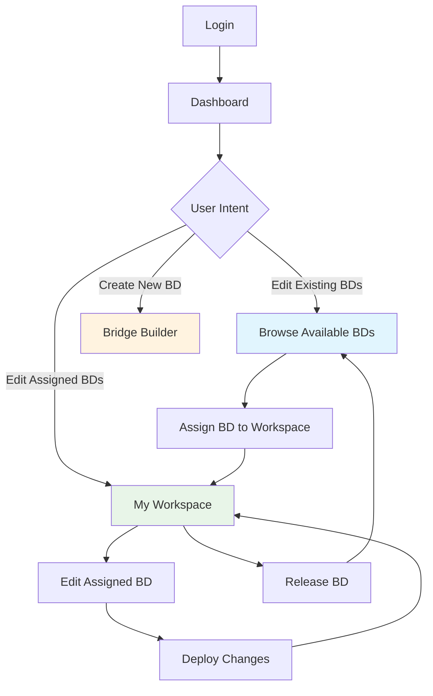

# 📋 Configurations Page Layout Analysis
## 🎯 **CURRENT STATE & REDESIGN PROPOSAL**

---

## 📊 **CURRENT CONFIGURATIONS PAGE ANALYSIS**

### **📐 CURRENT LAYOUT (3,528 lines - COMPLEX):**
```
┌─────────────────────────────────────────────────────────────────────────────────────┐
│ ■■■■■■■■■■■■■■■■■■■■■■■■■■■■■■■■■■■■■■■■■■■■■■■■■■■■■■■■■■■■■■■■■■■■■■■■■■■■■■■■■■■■■ │
│ ■■  📋 My Configurations                                                        ■■ │
│ ■■  Configuration management and deployment platform                            ■■ │
│ ■■■■■■■■■■■■■■■■■■■■■■■■■■■■■■■■■■■■■■■■■■■■■■■■■■■■■■■■■■■■■■■■■■■■■■■■■■■■■■■■■■■■■ │
├─────────────────────────────────────────────────────────────────────────────────────┤
│ ░░░░░░░░░░░░░░░░░░░░░░░░░░░░░░░░░░░░░░░░░░░░░░░░░░░░░░░░░░░░░░░░░░░░░░░░░░░░░░░░░░░░░ │
│ ░  📊 IMPORT BRIDGE DOMAIN SECTION (Legacy - Complex)                               ░ │
│ ░  [Import Bridge Domain] → Complex import wizard → Reverse engineering workflow   ░ │
│ ░  Large modal with device selection, scanning, configuration generation           ░ │
│ ░░░░░░░░░░░░░░░░░░░░░░░░░░░░░░░░░░░░░░░░░░░░░░░░░░░░░░░░░░░░░░░░░░░░░░░░░░░░░░░░░░░░░ │
├─────────────────────────────────────────────────────────────────────────────────────┤
│ ▓▓▓▓▓▓▓▓▓▓▓▓▓▓▓▓▓▓▓▓▓▓▓▓▓▓▓▓▓▓▓▓▓▓▓▓▓▓▓▓▓▓▓▓▓▓▓▓▓▓▓▓▓▓▓▓▓▓▓▓▓▓▓▓▓▓▓▓▓▓▓▓▓▓▓▓▓▓▓▓▓ │
│ ▓  📑 TAB NAVIGATION (6 tabs)                                                       ▓ │
│ ▓  [📋 My Workspace] [All] [Pending] [Deployed] [Failed] [Deleted]                 ▓ │
│ ▓▓▓▓▓▓▓▓▓▓▓▓▓▓▓▓▓▓▓▓▓▓▓▓▓▓▓▓▓▓▓▓▓▓▓▓▓▓▓▓▓▓▓▓▓▓▓▓▓▓▓▓▓▓▓▓▓▓▓▓▓▓▓▓▓▓▓▓▓▓▓▓▓▓▓▓▓▓▓▓▓ │
├─────────────────────────────────────────────────────────────────────────────────────┤
│ ┌─────────────────────────────────────────────────────────────────────────────────┐ │
│ │ 📋 TAB CONTENT AREA                                                             │ │
│ │ ┌─────────────────────────────────────────────────────────────────────────────┐ │ │
│ │ │ My Workspace Tab:                                                           │ │ │
│ │ │ ├── UserWorkspace.tsx component                                             │ │ │
│ │ │ ├── Personal assigned bridge domains (2 currently)                         │ │ │
│ │ │ ├── Assignment management and exclusive editing                             │ │ │
│ │ │ └── [✏️ Edit] [📤 Release] actions                                          │ │ │
│ │ └─────────────────────────────────────────────────────────────────────────────┘ │ │
│ │ ┌─────────────────────────────────────────────────────────────────────────────┐ │ │
│ │ │ Other Tabs (All, Pending, etc.):                                           │ │ │
│ │ │ ├── Legacy configuration management                                         │ │ │
│ │ │ ├── Complex deployment workflows                                            │ │ │
│ │ │ ├── Debug windows and testing interfaces                                   │ │ │
│ │ │ └── Multiple wizard demo sections                                           │ │ │
│ │ └─────────────────────────────────────────────────────────────────────────────┘ │ │
│ └─────────────────────────────────────────────────────────────────────────────────┘ │
├─────────────────────────────────────────────────────────────────────────────────────┤
│ ░░░░░░░░░░░░░░░░░░░░░░░░░░░░░░░░░░░░░░░░░░░░░░░░░░░░░░░░░░░░░░░░░░░░░░░░░░░░░░░░░░░░░ │
│ ░  📊 COMPLEX MODAL SYSTEMS (Multiple overlapping modals)                           ░ │
│ ░  ├── Configuration Details Modal                                                  ░ │
│ ░  ├── Deployment Preview Modal                                                     ░ │
│ ░  ├── Debug Window Modal                                                           ░ │
│ ░  ├── Smart Deployment Wizard                                                      ░ │
│ ░  └── Multiple wizard demo sections                                                ░ │
│ ░░░░░░░░░░░░░░░░░░░░░░░░░░░░░░░░░░░░░░░░░░░░░░░░░░░░░░░░░░░░░░░░░░░░░░░░░░░░░░░░░░░░░ │
└─────────────────────────────────────────────────────────────────────────────────────┘

CURRENT ISSUES:
├── ❌ MASSIVE FILE: 3,528 lines (unmanageable)
├── ❌ MIXED PURPOSES: Legacy configs + new workspace + debug code
├── ❌ COMPLEX NAVIGATION: 6 tabs with unclear purposes
├── ❌ REDUNDANT CODE: Multiple wizard demos and testing interfaces
├── ❌ CONFUSING UX: Users don't understand the difference between tabs
└── ❌ MAINTENANCE BURDEN: Too much legacy code to maintain
```

### **📊 CURRENT TAB ANALYSIS:**
```
TAB USAGE ANALYSIS:
┌─────────────────┬─────────────┬─────────────┬─────────────┬─────────────┐
│ Tab             │ Purpose     │ Usage       │ User Value  │ Recommendation │
├─────────────────┼─────────────┼─────────────┼─────────────┼─────────────┤
│ 📋 My Workspace │ BD Editor   │ ✅ Active   │ 🔥 Critical │ ✅ Keep      │
│ 📊 All          │ All configs │ 🟡 Legacy   │ 🟡 Low      │ 🔄 Simplify  │
│ ⏳ Pending      │ Pending     │ 🟡 Legacy   │ 🟡 Low      │ 🔄 Merge     │
│ ✅ Deployed     │ Deployed    │ 🟡 Legacy   │ 🟡 Low      │ 🔄 Merge     │
│ ❌ Failed       │ Failed      │ 🟡 Legacy   │ 🟡 Low      │ 🔄 Merge     │
│ 🗑️ Deleted      │ Deleted     │ ❌ Unused   │ ❌ None     │ ❌ Remove    │
└─────────────────┴─────────────┴─────────────┴─────────────┴─────────────┘
```

---

## 🎯 **REDESIGN PROPOSAL: SIMPLIFIED CONFIGURATIONS**

### **📐 PROPOSED LAYOUT (Clean & Focused):**
```
┌─────────────────────────────────────────────────────────────────────────────────────┐
│ ■■■■■■■■■■■■■■■■■■■■■■■■■■■■■■■■■■■■■■■■■■■■■■■■■■■■■■■■■■■■■■■■■■■■■■■■■■■■■■■■■■■■■ │
│ ■■  📋 Bridge Domain Management                                                 ■■ │
│ ■■  Organize and edit your bridge domain configurations                         ■■ │
│ ■■■■■■■■■■■■■■■■■■■■■■■■■■■■■■■■■■■■■■■■■■■■■■■■■■■■■■■■■■■■■■■■■■■■■■■■■■■■■■■■■■■■■ │
├─────────────────────────────────────────────────────────────────────────────────────┤
│ ░░░░░░░░░░░░░░░░░░░░░░░░░░░░░░░░░░░░░░░░░░░░░░░░░░░░░░░░░░░░░░░░░░░░░░░░░░░░░░░░░░░░░ │
│ ░  📊 QUICK STATS DASHBOARD                                                         ░ │
│ ░  ┌─────────┐ ┌─────────┐ ┌─────────┐ ┌─────────┐                                 ░ │
│ ░  │    2    │ │    0    │ │    0    │ │   524   │                                 ░ │
│ ░  │Assigned │ │Created  │ │Deployed │ │Available│                                 ░ │
│ ░  │to Edit  │ │by You   │ │ Live    │ │to Assign│                                 ░ │
│ ░  └─────────┘ └─────────┘ └─────────┘ └─────────┘                                 ░ │
│ ░░░░░░░░░░░░░░░░░░░░░░░░░░░░░░░░░░░░░░░░░░░░░░░░░░░░░░░░░░░░░░░░░░░░░░░░░░░░░░░░░░░░░ │
├─────────────────────────────────────────────────────────────────────────────────────┤
│ ▓▓▓▓▓▓▓▓▓▓▓▓▓▓▓▓▓▓▓▓▓▓▓▓▓▓▓▓▓▓▓▓▓▓▓▓▓▓▓▓▓▓▓▓▓▓▓▓▓▓▓▓▓▓▓▓▓▓▓▓▓▓▓▓▓▓▓▓▓▓▓▓▓▓▓▓▓▓▓▓▓ │
│ ▓  📑 SIMPLIFIED TAB NAVIGATION (3 tabs)                                           ▓ │
│ ▓  [📋 My Workspace] [🔨 My Creations] [🔍 Browse Available]                       ▓ │
│ ▓▓▓▓▓▓▓▓▓▓▓▓▓▓▓▓▓▓▓▓▓▓▓▓▓▓▓▓▓▓▓▓▓▓▓▓▓▓▓▓▓▓▓▓▓▓▓▓▓▓▓▓▓▓▓▓▓▓▓▓▓▓▓▓▓▓▓▓▓▓▓▓▓▓▓▓▓▓▓▓▓ │
├─────────────────────────────────────────────────────────────────────────────────────┤
│ ┌─────────────────────────────────────────────────────────────────────────────────┐ │
│ │ 📋 MY WORKSPACE TAB (Primary - Focus)                                          │ │
│ │ ┌─────────────────────────────────────────────────────────────────────────────┐ │ │
│ │ │ 👤 Personal Dashboard                                                       │ │ │
│ │ │ ├── Assigned Bridge Domains: 2                                             │ │ │
│ │ │ ├── Ready for Editing: 2                                                   │ │ │
│ │ │ ├── Deployed: 0                                                            │ │ │
│ │ │ └── [🔍 Browse More BDs] [📊 View Statistics]                              │ │ │
│ │ └─────────────────────────────────────────────────────────────────────────────┘ │ │
│ │ ┌─────────────────────────────────────────────────────────────────────────────┐ │ │
│ │ │ 🔵 Assigned Bridge Domain Cards                                             │ │ │
│ │ │ ┌─────────────────────────────────────────────────────────────────────────┐ │ │ │
│ │ │ │ g_oalfasi_v100                                      [pending]           │ │ │ │
│ │ │ │ VLAN 100 │ 2A_QINQ │ 2 endpoints │ Original: oalfasi                   │ │ │ │
│ │ │ │ 📅 Assigned: 2025-09-25 12:08:48                                       │ │ │ │
│ │ │ │ [✏️ Edit Bridge Domain] [📤 Release from Workspace]                     │ │ │ │
│ │ │ └─────────────────────────────────────────────────────────────────────────┘ │ │ │
│ │ └─────────────────────────────────────────────────────────────────────────────┘ │ │
│ └─────────────────────────────────────────────────────────────────────────────────┘ │
└─────────────────────────────────────────────────────────────────────────────────────┘

CURRENT PROBLEMS:
├── ❌ TAB CONFUSION: 6 tabs with unclear differences
├── ❌ LEGACY BLOAT: Complex import wizards and demo sections
├── ❌ MIXED PURPOSES: Personal workspace mixed with system configs
├── ❌ POOR UX: Users confused about which tab to use
└── ❌ MAINTENANCE: 3,528 lines with debug and testing code
```

---

## 🎨 **REDESIGN PROPOSAL: CLEAN & FOCUSED**

### **📐 PROPOSED LAYOUT (Simplified & Clear):**
```
┌─────────────────────────────────────────────────────────────────────────────────────┐
│ ■■■■■■■■■■■■■■■■■■■■■■■■■■■■■■■■■■■■■■■■■■■■■■■■■■■■■■■■■■■■■■■■■■■■■■■■■■■■■■■■■■■■■ │
│ ■■  📋 My Bridge Domain Workspace                                               ■■ │
│ ■■  Personal workspace for editing assigned bridge domains                      ■■ │
│ ■■                                                                              ■■ │
│ ■■  [🔍 Browse Available BDs] [🔨 Create New BD] [📊 System Overview]           ■■ │
│ ■■■■■■■■■■■■■■■■■■■■■■■■■■■■■■■■■■■■■■■■■■■■■■■■■■■■■■■■■■■■■■■■■■■■■■■■■■■■■■■■■■■■■ │
├─────────────────────────────────────────────────────────────────────────────────────┤
│ ░░░░░░░░░░░░░░░░░░░░░░░░░░░░░░░░░░░░░░░░░░░░░░░░░░░░░░░░░░░░░░░░░░░░░░░░░░░░░░░░░░░░░ │
│ ░  📊 WORKSPACE STATISTICS                                                          ░ │
│ ░  ┌─────────┐ ┌─────────┐ ┌─────────┐ ┌─────────┐                                 ░ │
│ ░  │    2    │ │    0    │ │    2    │ │   522   │                                 ░ │
│ ░  │Assigned │ │Deployed │ │ Pending │ │Available│                                 ░ │
│ ░  │to Edit  │ │ Live    │ │ Changes │ │to Assign│                                 ░ │
│ ░  └─────────┘ └─────────┘ └─────────┘ └─────────┘                                 ░ │
│ ░░░░░░░░░░░░░░░░░░░░░░░░░░░░░░░░░░░░░░░░░░░░░░░░░░░░░░░░░░░░░░░░░░░░░░░░░░░░░░░░░░░░░ │
├─────────────────────────────────────────────────────────────────────────────────────┤
│ ▓▓▓▓▓▓▓▓▓▓▓▓▓▓▓▓▓▓▓▓▓▓▓▓▓▓▓▓▓▓▓▓▓▓▓▓▓▓▓▓▓▓▓▓▓▓▓▓▓▓▓▓▓▓▓▓▓▓▓▓▓▓▓▓▓▓▓▓▓▓▓▓▓▓▓▓▓▓▓▓▓ │
│ ▓  📋 MY ASSIGNED BRIDGE DOMAINS                                                    ▓ │
│ ▓  ┌─────────────────────────────────────────────────────────────────────────────┐  ▓ │
│ ▓  │ 🔵 g_oalfasi_v100                                      [pending]           │  ▓ │
│ ▓  │    VLAN 100 │ 2A_QINQ │ 2 endpoints │ Original: oalfasi                   │  ▓ │
│ ▓  │    📅 Assigned: Today at 12:08 │ 💡 Reason: User workspace assignment     │  ▓ │
│ ▓  │    ┌─────────────────────────────────────────────────────────────────────┐ │  ▓ │
│ ▓  │    │ 🔌 Endpoints: DNAAS-LEAF-B15:ge100-0/0/5.251, +1 more              │ │  ▓ │
│ ▓  │    │ 📜 Raw CLI: 2 commands available                                    │ │  ▓ │
│ ▓  │    │ 🎯 DNAAS Type: 2A_QINQ (outer VLAN manipulation)                   │ │  ▓ │
│ ▓  │    └─────────────────────────────────────────────────────────────────────┘ │  ▓ │
│ ▓  │    [✏️ Edit Interfaces] [📜 View Raw Config] [📤 Release from Workspace]  │  ▓ │
│ ▓  └─────────────────────────────────────────────────────────────────────────────┘  ▓ │
│ ▓  ┌─────────────────────────────────────────────────────────────────────────────┐  ▓ │
│ ▓  │ 🔵 g_oalfasi_v104_ixia-ncp3                            [pending]           │  ▓ │
│ ▓  │    VLAN 104 │ 4A_SINGLE │ 1 endpoint │ Original: oalfasi                  │  ▓ │
│ ▓  │    📅 Assigned: Today at 12:11 │ 💡 Reason: Testing workspace assignment │  ▓ │
│ ▓  │    ┌─────────────────────────────────────────────────────────────────────┐ │  ▓ │
│ ▓  │    │ 🔌 Endpoints: DNAAS-LEAF-A01:ge100-0/0/1.104                       │ │  ▓ │
│ ▓  │    │ 📜 Raw CLI: 3 commands available                                    │ │  ▓ │
│ ▓  │    │ 🎯 DNAAS Type: 4A_SINGLE (simple VLAN configuration)               │ │  ▓ │
│ ▓  │    └─────────────────────────────────────────────────────────────────────┘ │  ▓ │
│ ▓  │    [✏️ Edit Interfaces] [📜 View Raw Config] [📤 Release from Workspace]  │  ▓ │
│ ▓  └─────────────────────────────────────────────────────────────────────────────┘  ▓ │
│ ▓▓▓▓▓▓▓▓▓▓▓▓▓▓▓▓▓▓▓▓▓▓▓▓▓▓▓▓▓▓▓▓▓▓▓▓▓▓▓▓▓▓▓▓▓▓▓▓▓▓▓▓▓▓▓▓▓▓▓▓▓▓▓▓▓▓▓▓▓▓▓▓▓▓▓▓▓▓▓▓▓ │
├─────────────────────────────────────────────────────────────────────────────────────┤
│ ┌─────────────────────────────────────────────────────────────────────────────────┐ │
│ │ 📊 WORKSPACE MANAGEMENT                                                         │ │
│ │ ├── [🔍 Browse & Assign More BDs] → Navigate to BD Browser                     │ │
│ │ ├── [📊 View Assignment History] → Show assignment timeline                     │ │
│ │ ├── [⚙️ Workspace Settings] → Manage preferences                               │ │
│ │ └── [📤 Release All] → Bulk workspace management                               │ │
│ └─────────────────────────────────────────────────────────────────────────────────┘ │
└─────────────────────────────────────────────────────────────────────────────────────┘

PROPOSED IMPROVEMENTS:
├── ✅ SINGLE FOCUS: Personal workspace only (no confusing tabs)
├── ✅ CLEAR PURPOSE: Assigned BD management and editing
├── ✅ RICH CONTEXT: BD details, endpoints, CLI info in cards
├── ✅ DIRECT ACTIONS: Edit, view config, release from each card
├── ✅ WORKSPACE MANAGEMENT: Tools for bulk operations and settings
└── ✅ NAVIGATION: Clear links to other workflows (browse, create)
```

### **📱 MOBILE LAYOUT (Responsive):**
```
┌─────────────────────────────┐
│ ■■■■■■■■■■■■■■■■■■■■■■■■■■■ │
│ ■■  📋 My Workspace    ■■ │
│ ■■■■■■■■■■■■■■■■■■■■■■■■■■■ │
├─────────────────────────────┤
│ ░ 📊 Stats: 2 Assigned  ░ │
│ ░ [🔍 Browse] [🔨 Create] ░ │
│ ░░░░░░░░░░░░░░░░░░░░░░░░░░░ │
├─────────────────────────────┤
│ ┌─────────────────────────┐ │
│ │🔵 g_oalfasi_v100       │ │
│ │   VLAN 100 │ 2A_QINQ   │ │
│ │   2 endpoints │ pending │ │
│ │   📅 Assigned today    │ │
│ │   [✏️ Edit] [📜 Config] │ │
│ │   [📤 Release]         │ │
│ └─────────────────────────┘ │
│ ┌─────────────────────────┐ │
│ │🔵 g_oalfasi_v104       │ │
│ │   VLAN 104 │ 4A_SINGLE │ │
│ │   1 endpoint │ pending  │ │
│ │   📅 Assigned today    │ │
│ │   [✏️ Edit] [📜 Config] │ │
│ │   [📤 Release]         │ │
│ └─────────────────────────┘ │
└─────────────────────────────┘
```

---

## 🔄 **REDESIGN RATIONALE**

### **🎯 WHY SIMPLIFY:**

#### **❌ CURRENT PROBLEMS:**
- **Tab Confusion**: Users don't understand 6 different tabs
- **Mixed Purposes**: Personal workspace mixed with system configurations
- **Legacy Bloat**: 2,000+ lines of unused demo and debug code
- **Poor UX**: Complex navigation for simple task (edit assigned BDs)
- **Maintenance Burden**: Too much code to maintain and debug

#### **✅ PROPOSED SOLUTIONS:**
- **Single Focus**: Personal workspace for assigned BDs only
- **Clear Purpose**: Edit assigned bridge domains exclusively
- **Rich Context**: All BD information visible in cards
- **Direct Actions**: Edit, view, release directly from cards
- **Simple Navigation**: Clear links to other workflows

### **📊 TAB SIMPLIFICATION:**
```
CURRENT (Confusing):                PROPOSED (Clear):
├── 📋 My Workspace                ├── 📋 My Workspace (ONLY TAB)
├── 📊 All (legacy)               │   ├── Focus: Assigned BDs only
├── ⏳ Pending (legacy)            │   ├── Actions: Edit, view, release
├── ✅ Deployed (legacy)           │   ├── Context: Rich BD information
├── ❌ Failed (legacy)             │   └── Navigation: Links to other workflows
└── 🗑️ Deleted (unused)           └── NO OTHER TABS (simplified)

RESULT: 6 tabs → 1 focused workspace
```

---

## 🚀 **IMPLEMENTATION STRATEGY**

### **📋 PHASE 1: CONTENT SIMPLIFICATION**
```
SIMPLIFY CONFIGURATIONS.TSX:
├── 🗑️ Remove legacy tab system (keep only My Workspace)
├── 🗑️ Remove import bridge domain wizard (complex, unused)
├── 🗑️ Remove demo sections and testing code
├── 🗑️ Remove debug windows and development tools
├── 🗑️ Remove reverse engineering workflows
└── ✅ Keep UserWorkspace component integration

ESTIMATED REDUCTION: 3,528 → 800 lines (77% reduction)
```

### **📋 PHASE 2: ENHANCED WORKSPACE DESIGN**
```
ENHANCE MY WORKSPACE:
├── 🎨 Rich BD cards with expanded information
├── 🎨 Better assignment metadata display
├── 🎨 Enhanced action button grouping
├── 🎨 Workspace management tools
├── 🎨 Quick navigation to other workflows
└── 🎨 Professional dashboard aesthetic

RESULT: Focused, professional workspace interface
```

### **📋 PHASE 3: NAVIGATION INTEGRATION**
```
IMPROVE WORKFLOW CONNECTIONS:
├── 🔗 Clear links to BD Browser (for assignment)
├── 🔗 Clear links to Bridge Builder (for creation)
├── 🔗 Quick access to system overview
├── 🔗 Workspace management tools
└── 🔗 User preference settings

RESULT: Seamless workflow integration
```

---

## 🎯 **PROPOSED USER EXPERIENCE**

### **📋 SIMPLIFIED USER JOURNEY:**


### **🎯 WORKSPACE-CENTRIC DESIGN:**
```
USER MENTAL MODEL:
├── 📋 "My Workspace" = My personal editing environment
├── 🔍 "BD Browser" = Find BDs to assign to workspace
├── 🔨 "Bridge Builder" = Create completely new BDs
├── 📊 "Dashboard" = System overview and quick actions
└── ⚙️ "Settings" = User preferences and VLAN ranges

WORKFLOW CLARITY:
├── ASSIGN: BD Browser → Assign → My Workspace
├── EDIT: My Workspace → Edit → Deploy → My Workspace
├── CREATE: Bridge Builder → Configure → Deploy
└── MANAGE: My Workspace → Release → BD Browser
```

---

## 📊 **IMPLEMENTATION BENEFITS**

### **✅ USER EXPERIENCE BENEFITS:**
- **🎯 Clear Purpose**: Single-focus workspace for assigned BDs
- **📊 Rich Context**: All BD information visible at once
- **⚡ Direct Actions**: Edit, view, release without navigation
- **🔗 Clear Workflows**: Obvious connections to other tools
- **📱 Mobile Friendly**: Simplified design works on all devices

### **🔧 DEVELOPMENT BENEFITS:**
- **📉 Code Reduction**: 3,528 → 800 lines (77% smaller)
- **🎨 Design Focus**: Single component to enhance
- **🔧 Easy Maintenance**: Clear, focused functionality
- **🚀 Performance**: Faster loading, smaller bundle
- **📚 Clear Documentation**: Obvious component purpose

### **🎨 DESIGN BENEFITS:**
- **🎯 Visual Hierarchy**: Clear information organization
- **🎨 Professional Appearance**: Enterprise-ready interface
- **📊 Consistent Patterns**: Unified design language
- **♿ Better Accessibility**: Simplified navigation structure
- **📱 Responsive Design**: Works across all screen sizes

---

## 🚀 **NEXT STEPS**

### **📋 IMPLEMENTATION PLAN:**
1. **🧹 Simplify Configurations.tsx** (remove legacy tabs and code)
2. **🎨 Enhance UserWorkspace component** (rich cards, better layout)
3. **🔗 Add navigation links** (to BD Browser, Bridge Builder)
4. **📊 Integrate real statistics** (workspace metrics)
5. **🎨 Apply professional design** (consistent with design tokens)

### **🎯 SUCCESS CRITERIA:**
- **📉 File Size**: 3,528 → 800 lines (manageable)
- **🎯 Single Purpose**: Personal workspace only
- **🎨 Professional Design**: Enterprise-ready appearance
- **⚡ Performance**: Fast loading and smooth interactions
- **👤 User Clarity**: Obvious purpose and actions

**This redesign transforms the complex Configurations page into a clean, focused "My Workspace" interface that users will understand and love to use!** 🎯

**Ready to implement this simplified, professional workspace design?**
