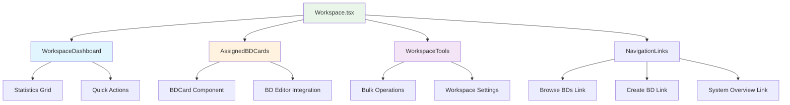
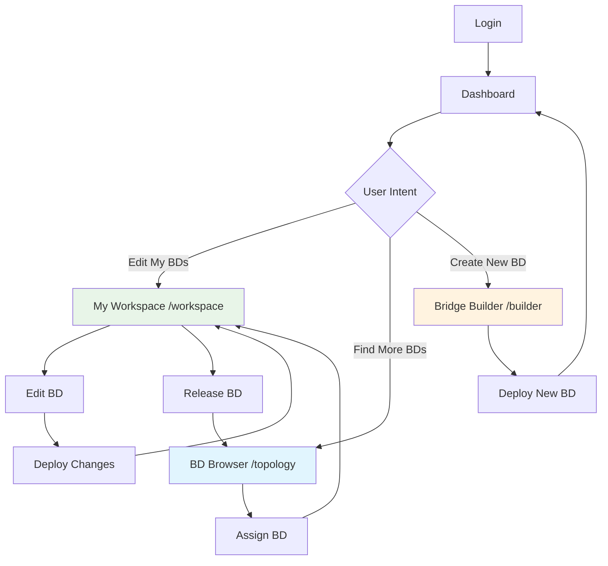

# 👤 Workspace Page Design
## 🎯 **DEDICATED USER WORKSPACE - STANDALONE PAGE**

---

## 🚀 **WORKSPACE PAGE CONCEPT**

### **📊 PAGE PURPOSE:**
```
DEDICATED WORKSPACE PAGE (/workspace):
├── 🎯 SINGLE PURPOSE: Personal BD workspace management
├── 👤 USER-CENTRIC: Focus entirely on user's assigned bridge domains
├── 🔧 EDITING HUB: Central location for all BD editing activities
├── 📊 WORKSPACE ANALYTICS: Personal productivity and assignment metrics
└── 🔗 WORKFLOW INTEGRATION: Clear connections to discovery and creation
```

### **🔄 WORKFLOW SEPARATION:**
```
CLEAR PAGE SEPARATION:
├── 🔍 /topology (BD Browser) → DISCOVER & ASSIGN existing BDs
├── 👤 /workspace (NEW PAGE) → EDIT assigned BDs exclusively
├── 🔨 /builder → CREATE new BDs from scratch
├── 📋 /configurations → LEGACY system configs (preserved aside)
└── 📊 / (Dashboard) → SYSTEM overview and navigation
```

---

## 📐 **WORKSPACE PAGE LAYOUT DESIGN**

### **🎨 PROPOSED LAYOUT (Clean & Focused):**
```
┌─────────────────────────────────────────────────────────────────────────────────────┐
│ ■■■■■■■■■■■■■■■■■■■■■■■■■■■■■■■■■■■■■■■■■■■■■■■■■■■■■■■■■■■■■■■■■■■■■■■■■■■■■■■■■■■■■ │
│ ■■  👤 My Bridge Domain Workspace                                               ■■ │
│ ■■  Personal workspace for editing assigned bridge domains                      ■■ │
│ ■■                                                                              ■■ │
│ ■■  [🔍 Browse & Assign More] [🔨 Create New BD] [📊 System Overview]           ■■ │
│ ■■■■■■■■■■■■■■■■■■■■■■■■■■■■■■■■■■■■■■■■■■■■■■■■■■■■■■■■■■■■■■■■■■■■■■■■■■■■■■■■■■■■■ │
├─────────────────────────────────────────────────────────────────────────────────────┤
│ ░░░░░░░░░░░░░░░░░░░░░░░░░░░░░░░░░░░░░░░░░░░░░░░░░░░░░░░░░░░░░░░░░░░░░░░░░░░░░░░░░░░░░ │
│ ░  📊 WORKSPACE DASHBOARD                                                           ░ │
│ ░  ┌─────────┐ ┌─────────┐ ┌─────────┐ ┌─────────┐ ┌─────────┐                     ░ │
│ ░  │    2    │ │    0    │ │    2    │ │    0    │ │   522   │                     ░ │
│ ░  │Assigned │ │Deployed │ │ Pending │ │ Editing │ │Available│                     ░ │
│ ░  │to Edit  │ │ Live    │ │ Changes │ │ Active  │ │to Assign│                     ░ │
│ ░  └─────────┘ └─────────┘ └─────────┘ └─────────┘ └─────────┘                     ░ │
│ ░░░░░░░░░░░░░░░░░░░░░░░░░░░░░░░░░░░░░░░░░░░░░░░░░░░░░░░░░░░░░░░░░░░░░░░░░░░░░░░░░░░░░ │
├─────────────────────────────────────────────────────────────────────────────────────┤
│ ▓▓▓▓▓▓▓▓▓▓▓▓▓▓▓▓▓▓▓▓▓▓▓▓▓▓▓▓▓▓▓▓▓▓▓▓▓▓▓▓▓▓▓▓▓▓▓▓▓▓▓▓▓▓▓▓▓▓▓▓▓▓▓▓▓▓▓▓▓▓▓▓▓▓▓▓▓▓▓▓▓ │
│ ▓  📋 MY ASSIGNED BRIDGE DOMAINS                                                    ▓ │
│ ▓  ┌─────────────────────────────────────────────────────────────────────────────┐  ▓ │
│ ▓  │ 🔵 g_oalfasi_v100                                      [pending]           │  ▓ │
│ ▓  │    ┌─────────────────────────────────────────────────────────────────────┐ │  ▓ │
│ ▓  │    │ 📊 BD Details                                                       │ │  ▓ │
│ ▓  │    │ VLAN 100 │ 2A_QINQ │ Original: oalfasi │ 2 endpoints               │ │  ▓ │
│ ▓  │    │ 📅 Assigned: Today 12:08 │ 💡 Reason: User workspace assignment     │ │  ▓ │
│ ▓  │    └─────────────────────────────────────────────────────────────────────┘ │  ▓ │
│ ▓  │    ┌─────────────────────────────────────────────────────────────────────┐ │  ▓ │
│ ▓  │    │ 🔌 Interface Preview                                                │ │  ▓ │
│ ▓  │    │ • DNAAS-LEAF-B15:ge100-0/0/5.251 (VLAN 100) - access               │ │  ▓ │
│ ▓  │    │ • DNAAS-LEAF-B14:ge100-0/0/12.251 (VLAN 100) - access              │ │  ▓ │
│ ▓  │    │ 💡 Uplink interfaces hidden (auto-managed)                          │ │  ▓ │
│ ▓  │    └─────────────────────────────────────────────────────────────────────┘ │  ▓ │
│ ▓  │    ┌─────────────────────────────────────────────────────────────────────┐ │  ▓ │
│ ▓  │    │ 🎯 Quick Actions                                                    │ │  ▓ │
│ ▓  │    │ [✏️ Edit Interfaces] [📜 View Raw CLI] [🚀 Deploy Changes]          │ │  ▓ │
│ ▓  │    │ [📤 Release from Workspace] [📊 Assignment Details]                 │ │  ▓ │
│ ▓  │    └─────────────────────────────────────────────────────────────────────┘ │  ▓ │
│ ▓  └─────────────────────────────────────────────────────────────────────────────┘  ▓ │
│ ▓▓▓▓▓▓▓▓▓▓▓▓▓▓▓▓▓▓▓▓▓▓▓▓▓▓▓▓▓▓▓▓▓▓▓▓▓▓▓▓▓▓▓▓▓▓▓▓▓▓▓▓▓▓▓▓▓▓▓▓▓▓▓▓▓▓▓▓▓▓▓▓▓▓▓▓▓▓▓▓▓ │
├─────────────────────────────────────────────────────────────────────────────────────┤
│ ┌─────────────────────────────────────────────────────────────────────────────────┐ │
│ │ 🛠️ WORKSPACE MANAGEMENT TOOLS                                                  │ │
│ │ ┌─────────────────────────────────────────────────────────────────────────────┐ │ │
│ │ │ 📊 Workspace Analytics                                                      │ │ │
│ │ │ • Total editing time: 2h 15m                                               │ │ │
│ │ │ • BDs edited this week: 3                                                  │ │ │
│ │ │ • Successful deployments: 1                                                │ │ │
│ │ │ • Average assignment duration: 1.5 days                                   │ │ │
│ │ └─────────────────────────────────────────────────────────────────────────────┘ │ │
│ │ ┌─────────────────────────────────────────────────────────────────────────────┐ │ │
│ │ │ 🔧 Bulk Operations                                                          │ │ │
│ │ │ [📤 Release All] [🚀 Deploy All Pending] [📊 Export Report]                │ │ │
│ │ └─────────────────────────────────────────────────────────────────────────────┘ │ │
│ └─────────────────────────────────────────────────────────────────────────────────┘ │
└─────────────────────────────────────────────────────────────────────────────────────┘

WORKSPACE PAGE BENEFITS:
├── ✅ SINGLE PURPOSE: Personal BD workspace only
├── ✅ RICH CONTEXT: Complete BD information in cards
├── ✅ DIRECT ACTIONS: Edit, deploy, release without navigation
├── ✅ WORKSPACE TOOLS: Analytics and bulk operations
├── ✅ CLEAR NAVIGATION: Links to discovery and creation workflows
└── ✅ PROFESSIONAL: Enterprise-ready workspace interface
```

### **📱 MOBILE WORKSPACE LAYOUT:**
```
┌─────────────────────────────┐
│ ■■■■■■■■■■■■■■■■■■■■■■■■■■■ │
│ ■■  👤 My Workspace    ■■ │
│ ■■■■■■■■■■■■■■■■■■■■■■■■■■■ │
├─────────────────────────────┤
│ ░ 📊 Quick Stats        ░ │
│ ░ 2 Assigned │ 0 Deployed ░ │
│ ░ [🔍 Browse] [🔨 Create] ░ │
│ ░░░░░░░░░░░░░░░░░░░░░░░░░░░ │
├─────────────────────────────┤
│ ┌─────────────────────────┐ │
│ │🔵 g_oalfasi_v100       │ │
│ │   VLAN 100 │ 2A_QINQ   │ │
│ │   📅 Today 12:08       │ │
│ │   🔌 2 endpoints       │ │
│ │   ┌───────────────────┐ │ │
│ │   │ [✏️ Edit]         │ │ │
│ │   │ [📜 CLI]          │ │ │
│ │   │ [📤 Release]      │ │ │
│ │   └───────────────────┘ │ │
│ └─────────────────────────┘ │
└─────────────────────────────┘
```

---

## 🔄 **IMPLEMENTATION STRATEGY**

### **📋 PHASE 1: CREATE STANDALONE WORKSPACE PAGE**
```
CREATE NEW WORKSPACE PAGE:
├── 📁 File: frontend/src/pages/Workspace.tsx
├── 🔗 Route: /workspace
├── 🎯 Purpose: Personal BD workspace management ONLY
├── 📊 Size: ~400 lines (focused, manageable)
├── 🧩 Components: Enhanced UserWorkspace component
└── 🎨 Design: Professional workspace interface

WORKSPACE.TSX STRUCTURE:
├── 📊 Workspace statistics dashboard
├── 🔵 Assigned BD cards with rich context
├── 🛠️ Workspace management tools
├── 🔗 Navigation to other workflows
└── 📱 Mobile-optimized responsive design
```

### **📋 PHASE 2: PRESERVE LEGACY CONFIGURATIONS**
```
PRESERVE /CONFIGURATIONS:
├── 📁 Keep: frontend/src/pages/Configurations.tsx (as-is)
├── 🔗 Route: /configurations (unchanged)
├── 🎯 Purpose: Legacy configuration management
├── 📊 Status: Available but not primary workflow
├── 🧩 Components: All existing legacy functionality
└── 🎨 Design: Original design preserved

CONFIGURATIONS PRESERVATION:
├── ✅ All existing tabs (All, Pending, Deployed, etc.)
├── ✅ Import bridge domain wizard
├── ✅ Reverse engineering workflows
├── ✅ Debug windows and testing interfaces
└── ✅ Complex deployment wizards
```

### **📋 PHASE 3: UPDATE NAVIGATION**
```
NAVIGATION ENHANCEMENT:
├── 📋 Sidebar: Add "👤 My Workspace" as primary navigation
├── 📊 Dashboard: Update quick actions to point to /workspace
├── 🔍 BD Browser: Assignment success → Navigate to /workspace
├── 📋 Configurations: Keep as secondary/admin option
└── 🎯 User Flow: Primary path through /workspace
```

---

## 📊 **WORKSPACE PAGE SPECIFICATIONS**

### **🎯 COMPONENT ARCHITECTURE:**


### **🔧 WORKSPACE COMPONENT BREAKDOWN:**
```
WORKSPACE.TSX COMPONENTS:
├── 📊 WorkspaceDashboard
│   ├── Personal statistics (assigned, deployed, pending)
│   ├── Productivity metrics (editing time, success rate)
│   ├── Quick action buttons
│   └── Workspace health indicators
│
├── 🔵 AssignedBDCards
│   ├── Enhanced BD cards with rich context
│   ├── Interface preview and endpoint counts
│   ├── Assignment metadata (date, reason, duration)
│   ├── Direct action buttons (edit, view, release)
│   └── DNAAS-type specific styling
│
├── 🛠️ WorkspaceTools
│   ├── Bulk operations (release all, deploy all)
│   ├── Workspace analytics and reporting
│   ├── Assignment history and timeline
│   └── Workspace preferences and settings
│
└── 🔗 NavigationLinks
    ├── Quick navigation to BD Browser (/topology)
    ├── Quick navigation to Bridge Builder (/builder)
    ├── System overview link (/)
    └── Legacy configurations link (/configurations)
```

---

## 🎨 **DETAILED WORKSPACE DESIGN**

### **📊 WORKSPACE DASHBOARD SECTION:**
```
┌─────────────────────────────────────────────────────────────────────────────────────┐
│ 📊 WORKSPACE DASHBOARD                                                              │
│ ┌─────────────────────────────────────────────────────────────────────────────────┐ │
│ │ Personal Statistics Grid (5 cards)                                             │ │
│ │ ┌─────────┐ ┌─────────┐ ┌─────────┐ ┌─────────┐ ┌─────────┐                     │ │
│ │ │    2    │ │    0    │ │    2    │ │    0    │ │   522   │                     │ │
│ │ │Assigned │ │Deployed │ │ Pending │ │ Editing │ │Available│                     │ │
│ │ │Bridge   │ │ Live    │ │ Changes │ │ Active  │ │to Assign│                     │ │
│ │ │Domains  │ │ Now     │ │ to Push │ │Sessions │ │from Pool│                     │ │
│ │ └─────────┘ └─────────┘ └─────────┘ └─────────┘ └─────────┘                     │ │
│ └─────────────────────────────────────────────────────────────────────────────────┘ │
│ ┌─────────────────────────────────────────────────────────────────────────────────┐ │
│ │ Quick Actions Bar                                                               │ │
│ │ [🔍 Browse & Assign More BDs] [🔨 Create New BD] [📊 View Full Dashboard]      │ │
│ │ [📈 Workspace Analytics] [⚙️ Workspace Settings] [📤 Bulk Release]             │ │
│ └─────────────────────────────────────────────────────────────────────────────────┘ │
└─────────────────────────────────────────────────────────────────────────────────────┘

DASHBOARD FEATURES:
├── 📊 Real-time statistics from user workspace API
├── 🎯 Personal productivity metrics and insights
├── ⚡ Quick actions for common workspace tasks
├── 🔗 Direct navigation to related workflows
└── 📱 Responsive grid layout for all screen sizes
```

### **🔵 ENHANCED BD CARDS SECTION:**
```
┌─────────────────────────────────────────────────────────────────────────────────────┐
│ 📋 ASSIGNED BRIDGE DOMAINS                                                         │
│ ┌─────────────────────────────────────────────────────────────────────────────────┐ │
│ │ 🔵 g_oalfasi_v100                                          [pending]           │ │
│ │ ┌─────────────────────────────────────────────────────────────────────────────┐ │ │
│ │ │ 📊 Bridge Domain Context                                                    │ │ │
│ │ │ ├── VLAN: 100 │ Type: 2A_QINQ │ Topology: p2mp                            │ │ │
│ │ │ ├── Original User: oalfasi │ Discovery Source: Network scan                │ │ │
│ │ │ ├── Assignment: Today 12:08 │ Reason: User workspace assignment            │ │ │
│ │ │ └── Status: Ready for editing │ Last modified: Never                       │ │ │
│ │ └─────────────────────────────────────────────────────────────────────────────┘ │ │
│ │ ┌─────────────────────────────────────────────────────────────────────────────┐ │ │
│ │ │ 🔌 Interface Details (User-Editable Endpoints Only)                        │ │ │
│ │ │ ├── DNAAS-LEAF-B15:ge100-0/0/5.251 (VLAN 100) - access                    │ │ │
│ │ │ │   📜 CLI: interfaces ge100-0/0/5.251 vlan-id 100                         │ │ │
│ │ │ ├── DNAAS-LEAF-B14:ge100-0/0/12.251 (VLAN 100) - access                   │ │ │
│ │ │ │   📜 CLI: interfaces ge100-0/0/12.251 vlan-id 100                        │ │ │
│ │ │ └── 💡 Infrastructure interfaces (uplinks) hidden - auto-managed           │ │ │
│ │ └─────────────────────────────────────────────────────────────────────────────┘ │ │
│ │ ┌─────────────────────────────────────────────────────────────────────────────┐ │ │
│ │ │ 🎯 Action Center                                                            │ │ │
│ │ │ Primary: [✏️ Edit Interfaces] [🚀 Deploy Changes]                           │ │ │
│ │ │ Secondary: [📜 View Full Raw Config] [📊 Assignment Details]                │ │ │
│ │ │ Management: [📤 Release from Workspace] [⚙️ BD Settings]                    │ │ │
│ │ └─────────────────────────────────────────────────────────────────────────────┘ │ │
│ └─────────────────────────────────────────────────────────────────────────────────┘ │
└─────────────────────────────────────────────────────────────────────────────────────┘

CARD FEATURES:
├── 🔵 Visual BD ownership indicator (blue left border)
├── 📊 Complete BD context in expandable sections
├── 🔌 Interface preview with CLI command snippets
├── 🎯 Organized action hierarchy (primary, secondary, management)
└── 📱 Collapsible sections for mobile optimization
```

### **🛠️ WORKSPACE TOOLS SECTION:**
```
┌─────────────────────────────────────────────────────────────────────────────────────┐
│ 🛠️ WORKSPACE MANAGEMENT & ANALYTICS                                                │
│ ┌─────────────────────────────┐ ┌─────────────────────────────┐                     │
│ │ 📈 Personal Analytics       │ │ 🔧 Bulk Operations          │                     │
│ │ ┌─────────────────────────┐ │ │ ┌─────────────────────────┐ │                     │
│ │ │ This Week:              │ │ │ │ Selected: 0 BDs         │ │                     │
│ │ │ • BDs Edited: 3         │ │ │ │ [Select All] [Select None]│ │                     │
│ │ │ • Deployments: 1        │ │ │ │                         │ │                     │
│ │ │ • Avg Time: 45min      │ │ │ │ Actions:                │ │                     │
│ │ │ • Success Rate: 100%   │ │ │ │ [📤 Release Selected]    │ │                     │
│ │ └─────────────────────────┘ │ │ │ [🚀 Deploy Selected]    │ │                     │
│ │ [📊 View Full Report]      │ │ │ [📋 Export Report]      │ │                     │
│ └─────────────────────────────┘ │ └─────────────────────────┘ │                     │
└─────────────────────────────────┴─────────────────────────────┘                     │
│ ┌─────────────────────────────────────────────────────────────────────────────────┐ │
│ │ 🔗 Quick Navigation                                                             │ │
│ │ [🔍 Browse Available BDs] → /topology (BD Browser)                             │ │
│ │ [🔨 Create New BD] → /builder (Bridge Builder)                                 │ │
│ │ [📊 System Overview] → / (Dashboard)                                           │ │
│ │ [📋 Legacy Configurations] → /configurations (Admin/Legacy)                   │ │
│ └─────────────────────────────────────────────────────────────────────────────────┘ │
└─────────────────────────────────────────────────────────────────────────────────────┘

TOOLS FEATURES:
├── 📈 Personal productivity analytics and insights
├── 🔧 Bulk operations for multi-BD management
├── 📊 Assignment history and timeline visualization
├── ⚙️ Workspace preferences and customization
└── 🔗 Clear navigation to all related workflows
```

---

## 🎯 **USER EXPERIENCE FLOW**

### **📋 WORKSPACE-CENTRIC WORKFLOW:**


### **🎯 WORKSPACE PAGE USER JOURNEY:**
```
WORKSPACE LANDING EXPERIENCE:
├── 1. 📊 See personal workspace statistics at glance
├── 2. 🔵 View assigned BDs with rich context
├── 3. 🎯 Take direct actions (edit, deploy, release)
├── 4. 🛠️ Use workspace tools for bulk operations
├── 5. 🔗 Navigate to other workflows as needed

WORKSPACE INTERACTION PATTERNS:
├── 📊 Dashboard Scanning: Quick status understanding
├── 🔵 Card Browsing: Detailed BD information review
├── ✏️ Direct Editing: One-click access to BD Editor
├── 📜 Config Viewing: Inline CLI command preview
└── 🔗 Workflow Navigation: Clear path to other tools
```

---

## 📊 **TECHNICAL IMPLEMENTATION**

### **📁 NEW FILE STRUCTURE:**
```
WORKSPACE PAGE IMPLEMENTATION:
├── 📁 frontend/src/pages/Workspace.tsx (NEW)
│   ├── Purpose: Dedicated workspace page
│   ├── Size: ~400 lines (focused)
│   ├── Components: WorkspaceDashboard, AssignedBDCards, WorkspaceTools
│   └── Integration: UserWorkspace.tsx (enhanced)
│
├── 🔧 Enhanced UserWorkspace.tsx
│   ├── Extract from Configurations.tsx
│   ├── Enhance with workspace-specific features
│   ├── Add workspace analytics and tools
│   └── Optimize for standalone page use
│
├── 🔗 App.tsx Routing Update
│   ├── Add: <Route path="workspace" element={<Workspace />} />
│   ├── Keep: <Route path="configurations" element={<Configurations />} />
│   └── Update: Default navigation priorities
│
└── 📋 Sidebar.tsx Navigation Update
    ├── Primary: "👤 My Workspace" → /workspace
    ├── Secondary: "📋 Configurations" → /configurations
    └── Workflow: Clear separation of purposes
```

### **🎨 DESIGN SPECIFICATIONS:**
```
WORKSPACE PAGE DESIGN:
├── 🎨 Color Scheme: Blue primary (workspace theme)
├── 📐 Layout: Dashboard-style with cards and grids
├── 🔵 BD Cards: Rich context with expandable sections
├── 📊 Statistics: Real-time workspace metrics
├── 🛠️ Tools: Professional bulk operation interface
├── 🔗 Navigation: Clear workflow connections
└── 📱 Responsive: Mobile-optimized card layouts

VISUAL HIERARCHY:
├── 1. Page header with navigation links
├── 2. Workspace statistics dashboard
├── 3. Assigned BD cards (primary content)
├── 4. Workspace management tools
└── 5. Footer with additional navigation
```

---

## 🚀 **IMPLEMENTATION BENEFITS**

### **✅ USER EXPERIENCE BENEFITS:**
- **🎯 Clear Purpose**: Workspace page = personal BD editing only
- **📊 Rich Context**: All BD information visible without drilling down
- **⚡ Direct Actions**: Edit, deploy, release without complex navigation
- **🔗 Workflow Clarity**: Obvious connections to discovery and creation
- **📱 Mobile Optimized**: Works perfectly on all devices

### **🔧 DEVELOPMENT BENEFITS:**
- **📉 Code Simplification**: Focused 400-line page vs 3,528-line complex page
- **🎨 Design Focus**: Single component to enhance professionally
- **🔧 Easy Maintenance**: Clear, focused functionality
- **🚀 Performance**: Faster loading, optimized for workspace use
- **📚 Clear Documentation**: Obvious component purpose and boundaries

### **🏗️ ARCHITECTURE BENEFITS:**
- **🔄 Separation of Concerns**: Personal workspace separate from system configs
- **📊 Scalability**: Easy to enhance workspace-specific features
- **🔒 Security**: Clear user attribution and workspace boundaries
- **👥 Multi-User Ready**: Personal workspace concept scales to teams
- **🎯 Professional**: Enterprise-ready workspace management

---

## 📋 **IMPLEMENTATION ROADMAP**

### **🚀 PHASE 1: CREATE WORKSPACE PAGE (Week 1)**
```
WORKSPACE PAGE CREATION:
├── Day 1: Create Workspace.tsx page structure
├── Day 2: Extract and enhance UserWorkspace component
├── Day 3: Add workspace dashboard and statistics
├── Day 4: Implement workspace tools and analytics
├── Day 5: Add navigation integration and testing
```

### **🎨 PHASE 2: DESIGN ENHANCEMENT (Week 2)**
```
PROFESSIONAL DESIGN:
├── Day 1: Apply design tokens and color scheme
├── Day 2: Enhance BD card design with rich context
├── Day 3: Implement responsive mobile layout
├── Day 4: Add micro-interactions and animations
├── Day 5: Accessibility and performance optimization
```

### **🔗 PHASE 3: INTEGRATION & POLISH (Week 3)**
```
WORKFLOW INTEGRATION:
├── Day 1: Update navigation and routing
├── Day 2: Integrate with BD Browser assignment flow
├── Day 3: Connect with BD Editor modal
├── Day 4: Add workspace analytics and reporting
├── Day 5: Final testing and documentation
```

---

## 🎯 **SUCCESS CRITERIA**

### **📊 FUNCTIONAL REQUIREMENTS:**
- **✅ Personal Focus**: Only user's assigned BDs visible
- **✅ Rich Context**: Complete BD information in cards
- **✅ Direct Actions**: Edit, deploy, release without navigation
- **✅ Workspace Tools**: Analytics, bulk operations, settings
- **✅ Clear Navigation**: Links to discovery and creation workflows

### **🎨 DESIGN REQUIREMENTS:**
- **✅ Professional Appearance**: Enterprise-ready workspace interface
- **✅ Responsive Design**: Works on desktop, tablet, mobile
- **✅ Consistent Styling**: Matches design token system
- **✅ Accessibility**: WCAG 2.1 AA compliance
- **✅ Performance**: <2 second loading, smooth interactions

### **👤 USER EXPERIENCE REQUIREMENTS:**
- **✅ Intuitive Navigation**: Users understand workspace purpose immediately
- **✅ Efficient Workflow**: Complete BD editing tasks in <5 minutes
- **✅ Clear Feedback**: All actions provide immediate, clear responses
- **✅ Professional Polish**: Suitable for daily use by network engineers

**This dedicated workspace page design creates a clean, focused, professional interface for personal BD management while preserving all existing functionality!** 🎯

**Ready to implement the standalone /workspace page with this enhanced design?** 🚀
