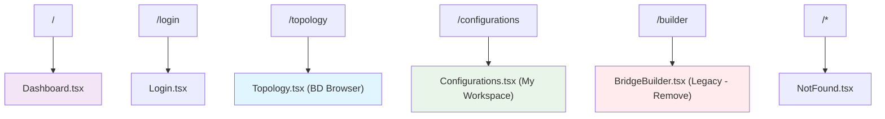
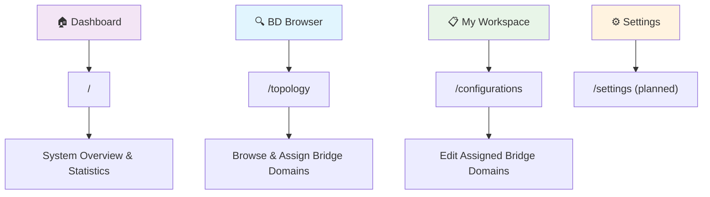
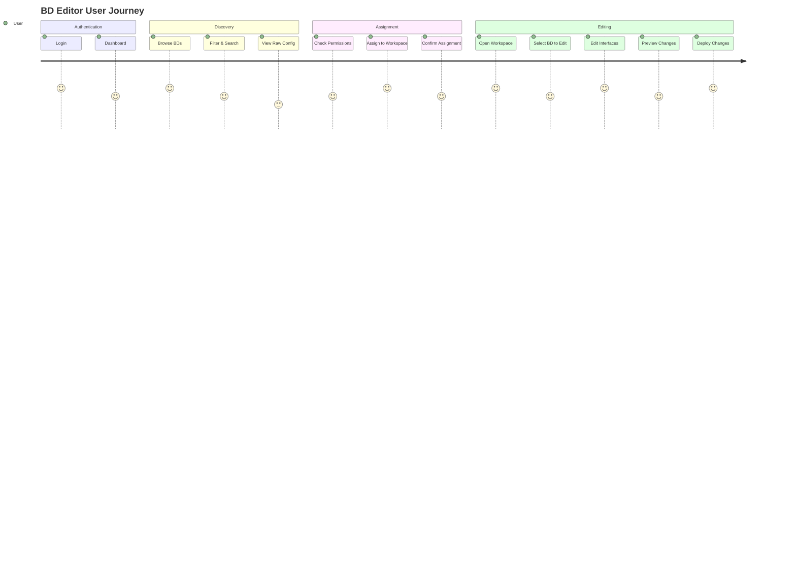
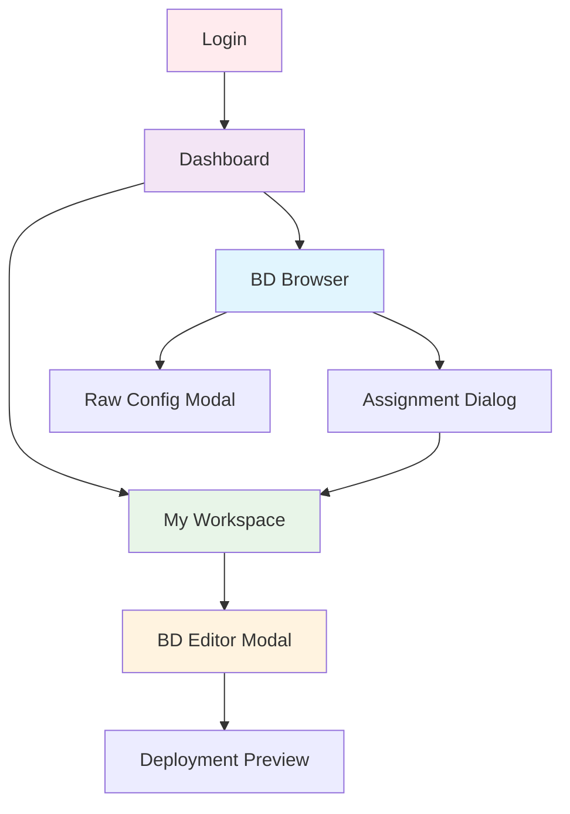

# 🗺️ Frontend Sitemap
## 📋 **PAGES, ROUTES, AND NAVIGATION STRUCTURE**

---

## 🌐 **ROUTE MAPPING**

### **📊 ACTIVE ROUTES:**


### **🎯 ROUTE PRIORITY:**
```
ACTIVE ROUTES (Keep):
├── 🏠 "/" → Dashboard.tsx (System overview)
├── 🔑 "/login" → Login.tsx (Authentication)
├── 🔍 "/topology" → Topology.tsx (BD Browser + Enhanced BD Browser)
├── 📋 "/configurations" → Configurations.tsx (My Workspace tab)
├── 🔨 "/builder" → BridgeBuilder.tsx (Create NEW bridge domains)
└── ❌ "/*" → NotFound.tsx (Error handling)

LEGACY ROUTES (Remove):
├── ❌ "/deployments" → Deployments.tsx (Not integrated)
├── ❌ "/files" → Files.tsx (Unused)
├── ❌ "/users" → UserManagement.tsx (Admin only, unused)
└── ❌ "/monitoring" → (Not implemented)
```

---

## 🧭 **NAVIGATION STRUCTURE**

### **📋 SIDEBAR NAVIGATION:**


### **🎯 NAVIGATION HIERARCHY:**
```
PRIMARY NAVIGATION (Sidebar):
├── 🏠 Dashboard
│   ├── System statistics (524 BDs, 2 assigned)
│   ├── Recent activity feed
│   ├── Quick action buttons
│   └── User info widget
├── 🔍 BD Browser  
│   ├── Enhanced BD Browser component
│   ├── Discovery & assignment interface
│   ├── Raw CLI configuration viewing
│   └── Advanced filtering & search (EDIT existing BDs)
├── 📋 My Workspace
│   ├── User Workspace component
│   ├── Assigned bridge domains (2 currently)
│   ├── Exclusive editing interface
│   └── Assignment management tools (EDIT assigned BDs)
├── 🔨 Bridge Builder
│   ├── Create NEW bridge domains from scratch
│   ├── P2P and P2MP topology support
│   ├── Device and interface selection
│   └── Configuration generation (CREATE new BDs)
└── ⚙️ Settings (Planned)
    ├── User preferences
    ├── VLAN range management
    └── Notification settings

SECONDARY NAVIGATION (Tabs):
├── Configurations Page Tabs:
│   ├── 📋 My Workspace (primary)
│   ├── 📊 All Configurations (legacy)
│   ├── ⏳ Pending (legacy)
│   ├── ✅ Deployed (legacy)
│   ├── ❌ Failed (legacy)
│   └── 🗑️ Deleted (legacy)
└── BD Browser Tabs: (Single page, no tabs)
```

---

## 🔄 **USER JOURNEY MAPPING**

### **🎯 PRIMARY USER FLOWS:**


### **📋 DETAILED NAVIGATION FLOWS:**

#### **🔍 BD Discovery Flow:**
```
Entry Points → BD Browser:
├── Dashboard → [Browse BDs] button → /topology
├── Sidebar → "BD Browser" → /topology
└── Direct URL → /topology

BD Browser Actions:
├── Search & Filter → Updated table view
├── View Raw Config → Modal dialog
├── Assign to Workspace → Confirmation dialog → Assignment
└── Quick Info → Tooltip/popover with BD details
```

#### **👤 Workspace Management Flow:**
```
Entry Points → My Workspace:
├── Dashboard → [My Workspace] button → /configurations?tab=workspace
├── Sidebar → "My Workspace" → /configurations
├── Assignment Success → Auto-navigate to workspace
└── Direct URL → /configurations

Workspace Actions:
├── Edit BD → BD Editor Modal
├── Release BD → Confirmation dialog → Unassignment
├── View Assignment Details → Expanded card view
└── Workspace Management → Bulk operations (planned)
```

---

## 📊 **PAGE INVENTORY & STATUS**

### **✅ ACTIVE PAGES (Keep & Enhance):**
```
PAGE STATUS MATRIX:
┌─────────────────┬─────────────┬─────────────┬─────────────┬─────────────┐
│ Page            │ Route       │ Status      │ Priority    │ Enhancement │
├─────────────────┼─────────────┼─────────────┼─────────────┼─────────────┤
│ Dashboard       │ /           │ ✅ Active   │ 🔥 High     │ 🎨 Polish   │
│ BD Browser      │ /topology   │ ✅ Active   │ 🔥 Critical │ 🎨 Major    │
│ My Workspace    │ /config*    │ ✅ Active   │ 🔥 Critical │ 🎨 Major    │
│ Login           │ /login      │ ✅ Active   │ 🔥 High     │ 🎨 Minor    │
│ NotFound        │ /*          │ ✅ Active   │ 🟡 Low      │ 🎨 Minor    │
└─────────────────┴─────────────┴─────────────┴─────────────┴─────────────┘

*Configurations page with workspace tab integration
```

### **❌ LEGACY PAGES (Remove):**
```
REMOVAL CANDIDATES:
┌─────────────────┬─────────────┬─────────────┬─────────────┬─────────────┐
│ Page            │ Route       │ Status      │ Reason      │ Action      │
├─────────────────┼─────────────┼─────────────┼─────────────┼─────────────┤
│ BridgeBuilder   │ /builder    │ ❌ Legacy   │ Replaced    │ 🗑️ Remove   │
│ Deployments     │ /deploy*    │ ❌ Unused   │ Not integrated│ 🗑️ Remove │
│ Files           │ /files      │ ❌ Unused   │ Not needed  │ 🗑️ Remove   │
│ UserManagement  │ /users      │ ❌ Unused   │ Admin only  │ 🗑️ Remove   │
│ Index           │ /index      │ ❌ Redirect │ Simple redirect│ 🗑️ Remove │
└─────────────────┴─────────────┴─────────────┴─────────────┴─────────────┘
```

---

## 🔗 **INTER-PAGE RELATIONSHIPS**

### **📊 PAGE DEPENDENCY GRAPH:**


### **🔄 NAVIGATION PATTERNS:**
```
COMMON NAVIGATION PATHS:
├── Login → Dashboard → BD Browser → Assignment → My Workspace → Edit
├── Dashboard → My Workspace → Edit → Deploy
├── BD Browser → Raw Config → Assignment → Edit
└── My Workspace → Edit → Preview → Deploy → Dashboard

NAVIGATION COMPONENTS:
├── Sidebar: Primary navigation (always visible)
├── Breadcrumbs: Secondary navigation (planned)
├── Action Buttons: Direct workflow navigation
└── Modal Navigation: In-modal workflow steps
```

---

## 🎯 **ENHANCEMENT ROADMAP**

### **📋 NAVIGATION IMPROVEMENTS:**
```
PHASE 1 (Current - Functional):
├── ✅ Basic sidebar navigation
├── ✅ Page routing with React Router
├── ✅ Modal-based editing workflow
└── ✅ Tab-based workspace organization

PHASE 2 (Lovable Enhancement):
├── 🎨 Enhanced visual navigation design
├── 🎨 Breadcrumb navigation system
├── 🎨 Improved mobile navigation
└── 🎨 Professional aesthetic polish

PHASE 3 (Advanced Features):
├── 🚀 Keyboard navigation shortcuts
├── 🚀 Customizable dashboard layout
├── 🚀 Advanced filtering interfaces
└── 🚀 Bulk operation workflows
```

### **🎨 DESIGN CONSISTENCY GOALS:**
```
CONSISTENCY TARGETS:
├── 🎯 Unified color scheme across all pages
├── 🎯 Consistent spacing and typography
├── 🎯 Standardized interaction patterns
├── 🎯 Professional network engineering aesthetic
└── 🎯 Accessibility compliance (WCAG 2.1 AA)
```

---

## 📚 **DOCUMENTATION MAINTENANCE**

### **🔄 UPDATE SCHEDULE:**
- **📊 Weekly**: Review and update page status
- **🎨 Per Design Change**: Update layouts and components
- **🚀 Per Feature**: Update flows and navigation
- **📋 Monthly**: Review and clean up documentation

### **✅ QUALITY CHECKLIST:**
- **📖 Accuracy**: Documentation matches implementation
- **🔄 Completeness**: All pages and components covered
- **🎯 Clarity**: Easy to understand and navigate
- **📊 Currency**: Up-to-date with latest changes

**This sitemap provides the foundation for understanding and enhancing the Lab Automation Framework frontend navigation and page structure.** 🎯
