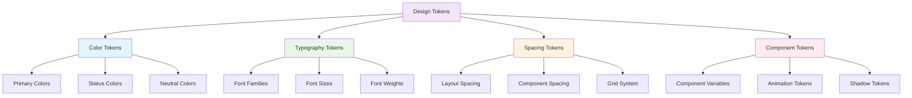

# 🎨 Design Tokens
## 📊 **DESIGN SYSTEM TOKENS & VARIABLES**

---

## 🎯 **TOKEN SYSTEM OVERVIEW**

### **📊 TOKEN CATEGORIES:**


---

## 🎨 **COLOR TOKEN SYSTEM**

### **🔵 PRIMARY COLORS:**
```css
/* Network Engineering Theme Colors */
:root {
  /* Blue - Primary/Network Theme */
  --color-primary-50: #eff6ff;
  --color-primary-100: #dbeafe;
  --color-primary-200: #bfdbfe;
  --color-primary-300: #93c5fd;
  --color-primary-400: #60a5fa;
  --color-primary-500: #3b82f6;  /* Main primary */
  --color-primary-600: #2563eb;
  --color-primary-700: #1d4ed8;
  --color-primary-800: #1e40af;
  --color-primary-900: #1e3a8a;
  
  /* Green - Success/Available */
  --color-success-50: #ecfdf5;
  --color-success-100: #d1fae5;
  --color-success-200: #a7f3d0;
  --color-success-300: #6ee7b7;
  --color-success-400: #34d399;
  --color-success-500: #10b981;  /* Main success */
  --color-success-600: #059669;
  --color-success-700: #047857;
  --color-success-800: #065f46;
  --color-success-900: #064e3b;
  
  /* Purple - QinQ/Advanced Features */
  --color-purple-50: #faf5ff;
  --color-purple-100: #f3e8ff;
  --color-purple-200: #e9d5ff;
  --color-purple-300: #d8b4fe;
  --color-purple-400: #c084fc;
  --color-purple-500: #a855f7;
  --color-purple-600: #9333ea;
  --color-purple-700: #7c3aed;
  --color-purple-800: #6b21a8;
  --color-purple-900: #581c87;
  
  /* Orange - Warnings/Pending */
  --color-warning-50: #fffbeb;
  --color-warning-100: #fef3c7;
  --color-warning-200: #fde68a;
  --color-warning-300: #fcd34d;
  --color-warning-400: #fbbf24;
  --color-warning-500: #f59e0b;  /* Main warning */
  --color-warning-600: #d97706;
  --color-warning-700: #b45309;
  --color-warning-800: #92400e;
  --color-warning-900: #78350f;
}
```

### **🏷️ DNAAS TYPE COLOR MAPPING:**
```css
/* DNAAS Type Specific Colors */
:root {
  /* 2A_QINQ - Purple Theme */
  --dnaas-qinq-bg: var(--color-purple-100);
  --dnaas-qinq-text: var(--color-purple-800);
  --dnaas-qinq-border: var(--color-purple-200);
  
  /* 4A_SINGLE - Blue Theme */
  --dnaas-single-bg: var(--color-primary-100);
  --dnaas-single-text: var(--color-primary-800);
  --dnaas-single-border: var(--color-primary-200);
  
  /* 1_DOUBLE - Green Theme */
  --dnaas-double-bg: var(--color-success-100);
  --dnaas-double-text: var(--color-success-800);
  --dnaas-double-border: var(--color-success-200);
  
  /* 5_PORT - Orange Theme */
  --dnaas-port-bg: var(--color-warning-100);
  --dnaas-port-text: var(--color-warning-800);
  --dnaas-port-border: var(--color-warning-200);
  
  /* OTHER/UNKNOWN - Gray Theme */
  --dnaas-other-bg: #f3f4f6;
  --dnaas-other-text: #374151;
  --dnaas-other-border: #e5e7eb;
}
```

### **📊 STATUS COLOR MAPPING:**
```css
/* Assignment & Deployment Status Colors */
:root {
  /* Assignment Status */
  --status-available-bg: var(--color-success-100);
  --status-available-text: var(--color-success-800);
  
  --status-assigned-bg: var(--color-primary-100);
  --status-assigned-text: var(--color-primary-800);
  
  --status-editing-bg: var(--color-warning-100);
  --status-editing-text: var(--color-warning-800);
  
  /* Deployment Status */
  --deploy-pending-bg: var(--color-warning-100);
  --deploy-pending-text: var(--color-warning-800);
  
  --deploy-deployed-bg: var(--color-success-100);
  --deploy-deployed-text: var(--color-success-800);
  
  --deploy-failed-bg: #fef2f2;
  --deploy-failed-text: #dc2626;
}
```

---

## 🔤 **TYPOGRAPHY TOKEN SYSTEM**

### **📝 FONT FAMILIES:**
```css
/* Typography System */
:root {
  /* Font Families */
  --font-primary: 'Inter', system-ui, -apple-system, sans-serif;
  --font-mono: 'Fira Code', 'JetBrains Mono', 'Consolas', monospace;
  --font-display: 'Inter Display', var(--font-primary);
  
  /* Font Sizes (rem units) */
  --font-size-xs: 0.75rem;    /* 12px */
  --font-size-sm: 0.875rem;   /* 14px */
  --font-size-base: 1rem;     /* 16px */
  --font-size-lg: 1.125rem;   /* 18px */
  --font-size-xl: 1.25rem;    /* 20px */
  --font-size-2xl: 1.5rem;    /* 24px */
  --font-size-3xl: 1.875rem;  /* 30px */
  --font-size-4xl: 2.25rem;   /* 36px */
  
  /* Font Weights */
  --font-weight-normal: 400;
  --font-weight-medium: 500;
  --font-weight-semibold: 600;
  --font-weight-bold: 700;
  
  /* Line Heights */
  --line-height-tight: 1.25;
  --line-height-normal: 1.5;
  --line-height-relaxed: 1.75;
}
```

### **📊 TYPOGRAPHY HIERARCHY:**
```css
/* Typography Hierarchy Classes */
.text-h1 {
  font-family: var(--font-display);
  font-size: var(--font-size-3xl);
  font-weight: var(--font-weight-bold);
  line-height: var(--line-height-tight);
}

.text-h2 {
  font-family: var(--font-primary);
  font-size: var(--font-size-2xl);
  font-weight: var(--font-weight-semibold);
  line-height: var(--line-height-tight);
}

.text-h3 {
  font-family: var(--font-primary);
  font-size: var(--font-size-xl);
  font-weight: var(--font-weight-medium);
  line-height: var(--line-height-normal);
}

.text-body {
  font-family: var(--font-primary);
  font-size: var(--font-size-base);
  font-weight: var(--font-weight-normal);
  line-height: var(--line-height-normal);
}

.text-code {
  font-family: var(--font-mono);
  font-size: var(--font-size-sm);
  font-weight: var(--font-weight-normal);
  line-height: var(--line-height-normal);
}
```

---

## 📐 **SPACING TOKEN SYSTEM**

### **📏 SPACING SCALE:**
```css
/* Spacing System (based on 4px grid) */
:root {
  --space-0: 0;
  --space-1: 0.25rem;   /* 4px */
  --space-2: 0.5rem;    /* 8px */
  --space-3: 0.75rem;   /* 12px */
  --space-4: 1rem;      /* 16px */
  --space-5: 1.25rem;   /* 20px */
  --space-6: 1.5rem;    /* 24px */
  --space-8: 2rem;      /* 32px */
  --space-10: 2.5rem;   /* 40px */
  --space-12: 3rem;     /* 48px */
  --space-16: 4rem;     /* 64px */
  --space-20: 5rem;     /* 80px */
  --space-24: 6rem;     /* 96px */
}
```

### **🏗️ LAYOUT TOKENS:**
```css
/* Layout System */
:root {
  /* Container Widths */
  --container-sm: 640px;
  --container-md: 768px;
  --container-lg: 1024px;
  --container-xl: 1280px;
  --container-2xl: 1536px;
  
  /* Sidebar */
  --sidebar-width: 240px;
  --sidebar-width-collapsed: 64px;
  
  /* Header */
  --header-height: 64px;
  
  /* Component Dimensions */
  --table-row-height: 64px;
  --card-min-height: 120px;
  --modal-max-width: 1024px;
  --modal-max-height: 80vh;
  
  /* Border Radius */
  --radius-sm: 0.25rem;   /* 4px */
  --radius-md: 0.375rem;  /* 6px */
  --radius-lg: 0.5rem;    /* 8px */
  --radius-xl: 0.75rem;   /* 12px */
}
```

---

## 🧩 **COMPONENT TOKEN SYSTEM**

### **📋 COMPONENT-SPECIFIC TOKENS:**
```css
/* BD Browser Component Tokens */
:root {
  /* Table */
  --bd-table-header-bg: var(--color-primary-50);
  --bd-table-row-hover: var(--color-primary-25);
  --bd-table-border: var(--color-primary-200);
  
  /* Assignment Status */
  --assignment-available: var(--color-success-500);
  --assignment-assigned: var(--color-primary-500);
  --assignment-you: var(--color-primary-600);
  
  /* Action Buttons */
  --btn-assign-bg: var(--color-primary-600);
  --btn-assign-hover: var(--color-primary-700);
  --btn-edit-bg: var(--color-success-600);
  --btn-edit-hover: var(--color-success-700);
  --btn-release-bg: transparent;
  --btn-release-border: var(--color-primary-300);
}

/* User Workspace Component Tokens */
:root {
  /* Workspace Cards */
  --workspace-card-border: var(--color-primary-500);
  --workspace-card-bg: white;
  --workspace-card-shadow: 0 1px 3px rgba(0, 0, 0, 0.1);
  
  /* Assignment Info */
  --assignment-meta-text: var(--color-primary-600);
  --assignment-date-text: var(--color-primary-500);
}

/* BD Editor Modal Tokens */
:root {
  /* Modal */
  --modal-backdrop: rgba(0, 0, 0, 0.5);
  --modal-bg: white;
  --modal-border: var(--color-primary-200);
  
  /* Interface Cards */
  --interface-card-bg: var(--color-primary-25);
  --interface-card-border: var(--color-primary-100);
  --interface-access-accent: var(--color-success-500);
  --interface-infrastructure-accent: var(--color-primary-300);
  
  /* CLI Code Display */
  --cli-bg: #f8fafc;
  --cli-text: #334155;
  --cli-border: #e2e8f0;
  --cli-highlight: var(--color-primary-100);
}
```

---

## 📊 **SEMANTIC TOKEN MAPPING**

### **🎯 SEMANTIC COLOR USAGE:**
```css
/* Semantic Color Assignments */
:root {
  /* BD Editor Semantic Colors */
  --bd-available: var(--color-success-500);
  --bd-assigned-other: var(--color-primary-400);
  --bd-assigned-you: var(--color-primary-600);
  --bd-editing: var(--color-warning-500);
  
  /* DNAAS Type Semantic Colors */
  --dnaas-qinq: var(--color-purple-600);
  --dnaas-single: var(--color-primary-600);
  --dnaas-double: var(--color-success-600);
  --dnaas-port: var(--color-warning-600);
  --dnaas-unknown: #6b7280;
  
  /* Status Semantic Colors */
  --status-deployed: var(--color-success-600);
  --status-pending: var(--color-warning-600);
  --status-failed: #dc2626;
  --status-available: var(--color-success-500);
  
  /* Interactive Semantic Colors */
  --interactive-primary: var(--color-primary-600);
  --interactive-secondary: var(--color-primary-100);
  --interactive-danger: #dc2626;
  --interactive-warning: var(--color-warning-600);
}
```

### **📊 COMPONENT STATE COLORS:**
```css
/* Component State Tokens */
:root {
  /* Button States */
  --btn-primary-default: var(--color-primary-600);
  --btn-primary-hover: var(--color-primary-700);
  --btn-primary-active: var(--color-primary-800);
  --btn-primary-disabled: var(--color-primary-300);
  
  --btn-secondary-default: transparent;
  --btn-secondary-hover: var(--color-primary-50);
  --btn-secondary-active: var(--color-primary-100);
  --btn-secondary-border: var(--color-primary-300);
  
  /* Input States */
  --input-default: white;
  --input-focus: white;
  --input-error: #fef2f2;
  --input-disabled: #f9fafb;
  --input-border-default: #d1d5db;
  --input-border-focus: var(--color-primary-500);
  --input-border-error: #dc2626;
  
  /* Card States */
  --card-default: white;
  --card-hover: var(--color-primary-25);
  --card-selected: var(--color-primary-50);
  --card-border: #e5e7eb;
  --card-shadow: 0 1px 3px rgba(0, 0, 0, 0.1);
  --card-shadow-hover: 0 4px 6px rgba(0, 0, 0, 0.1);
}
```

---

## 🎨 **COMPONENT DESIGN TOKENS**

### **📋 BD BROWSER TOKENS:**
```css
/* Enhanced Bridge Domain Browser */
:root {
  /* Table Design */
  --bd-table-header-height: 56px;
  --bd-table-row-height: 64px;
  --bd-table-padding: var(--space-4);
  --bd-table-gap: var(--space-2);
  
  /* Filter Section */
  --filter-section-height: 80px;
  --filter-gap: var(--space-4);
  --filter-input-height: 40px;
  
  /* Statistics Dashboard */
  --stats-card-width: 200px;
  --stats-card-height: 100px;
  --stats-grid-gap: var(--space-4);
  
  /* Assignment Actions */
  --assign-btn-width: 160px;
  --assign-btn-height: 36px;
  --action-group-gap: var(--space-2);
}
```

### **👤 USER WORKSPACE TOKENS:**
```css
/* User Workspace Component */
:root {
  /* Workspace Layout */
  --workspace-card-width: 100%;
  --workspace-card-min-height: 200px;
  --workspace-grid-gap: var(--space-6);
  --workspace-padding: var(--space-6);
  
  /* Assignment Cards */
  --assignment-card-border-width: 4px;
  --assignment-card-border-color: var(--color-primary-500);
  --assignment-card-padding: var(--space-4);
  --assignment-meta-spacing: var(--space-2);
  
  /* Statistics */
  --workspace-stats-height: 80px;
  --workspace-stats-gap: var(--space-4);
}
```

### **✏️ BD EDITOR MODAL TOKENS:**
```css
/* BD Editor Modal */
:root {
  /* Modal Dimensions */
  --modal-width: 1024px;
  --modal-height: 80vh;
  --modal-padding: var(--space-6);
  --modal-header-height: 80px;
  --modal-footer-height: 80px;
  
  /* Interface Management */
  --interface-card-height: 120px;
  --interface-card-gap: var(--space-4);
  --interface-list-padding: var(--space-4);
  
  /* CLI Display */
  --cli-block-padding: var(--space-4);
  --cli-line-height: 1.4;
  --cli-border-radius: var(--radius-md);
  
  /* Editing Actions */
  --edit-btn-group-gap: var(--space-2);
  --edit-btn-height: 40px;
  --edit-section-spacing: var(--space-6);
}
```

---

## 🎭 **ANIMATION & INTERACTION TOKENS**

### **⚡ ANIMATION TOKENS:**
```css
/* Animation System */
:root {
  /* Transition Durations */
  --duration-fast: 150ms;
  --duration-normal: 250ms;
  --duration-slow: 350ms;
  
  /* Transition Easings */
  --ease-in: cubic-bezier(0.4, 0, 1, 1);
  --ease-out: cubic-bezier(0, 0, 0.2, 1);
  --ease-in-out: cubic-bezier(0.4, 0, 0.2, 1);
  
  /* Component Animations */
  --modal-enter: var(--duration-normal) var(--ease-out);
  --table-hover: var(--duration-fast) var(--ease-out);
  --button-press: var(--duration-fast) var(--ease-in-out);
  --card-hover: var(--duration-normal) var(--ease-out);
}
```

### **🎨 SHADOW TOKENS:**
```css
/* Shadow System */
:root {
  /* Elevation Shadows */
  --shadow-sm: 0 1px 2px rgba(0, 0, 0, 0.05);
  --shadow-md: 0 4px 6px rgba(0, 0, 0, 0.1);
  --shadow-lg: 0 10px 15px rgba(0, 0, 0, 0.1);
  --shadow-xl: 0 20px 25px rgba(0, 0, 0, 0.1);
  
  /* Component Shadows */
  --card-shadow: var(--shadow-sm);
  --card-shadow-hover: var(--shadow-md);
  --modal-shadow: var(--shadow-xl);
  --table-shadow: var(--shadow-sm);
  --button-shadow: var(--shadow-sm);
}
```

---

## 🔗 **TOKEN SOURCE LINKS**

### **📊 TOKEN IMPLEMENTATION:**
```
TOKEN SOURCE FILES:
├── 🎨 CSS Variables: frontend/src/index.css (root variables)
├── 🎨 Tailwind Config: frontend/tailwind.config.ts (theme extension)
├── 🎨 Component Styles: Individual component files
└── 🎨 Utility Classes: shadcn/ui components

TAILWIND INTEGRATION:
├── Primary: colors.primary (maps to --color-primary-*)
├── Success: colors.success (maps to --color-success-*)
├── Warning: colors.warning (maps to --color-warning-*)
├── Purple: colors.purple (maps to --color-purple-*)
└── Spacing: spacing (maps to --space-*)

COMPONENT INTEGRATION:
├── className="bg-primary-100 text-primary-800"
├── className="text-h1" (custom typography classes)
├── style={{backgroundColor: 'var(--dnaas-qinq-bg)'}}
└── CSS modules with token references
```

### **🔄 TOKEN MAINTENANCE:**
```
TOKEN UPDATE WORKFLOW:
├── 1. 🎨 Update root variables in index.css
├── 2. 🔧 Update Tailwind config if needed
├── 3. 📊 Update component implementations
├── 4. 🧪 Test visual consistency
├── 5. 📝 Document changes in this file
└── 6. ✅ Validate accessibility compliance

TOKEN VALIDATION:
├── ✅ Color Contrast: Minimum 4.5:1 ratio
├── ✅ Typography: Readable hierarchy
├── ✅ Spacing: Consistent grid alignment
├── ✅ Component: Consistent application
└── ✅ Responsive: Proper scaling across breakpoints
```

---

## 🎯 **DESIGN TOKEN ROADMAP**

### **📋 CURRENT STATE (Version 2.0):**
- **✅ Basic color system** with primary/success/warning
- **✅ Typography hierarchy** with Inter font family
- **✅ Spacing system** based on Tailwind defaults
- **✅ Component tokens** for BD Editor components

### **🎨 ENHANCEMENT TARGETS (Version 3.0):**
- **🎨 Professional color refinement** for network engineering
- **🎨 Enhanced typography** with better hierarchy
- **🎨 Consistent spacing** across all components
- **🎨 Component token expansion** for all UI elements

### **🚀 ADVANCED FEATURES (Version 4.0):**
- **🌙 Dark mode tokens** for different themes
- **📱 Responsive tokens** for mobile optimization
- **♿ Accessibility tokens** for enhanced compliance
- **🎭 Animation tokens** for micro-interactions

**This design token system provides the foundation for consistent, professional UI design across the entire BD Editor frontend!** 🎯
