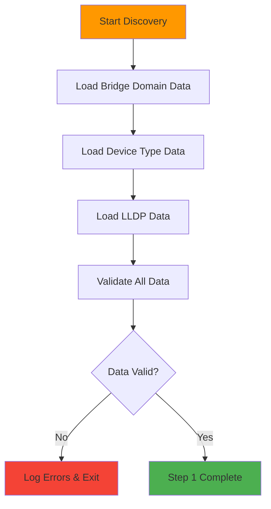
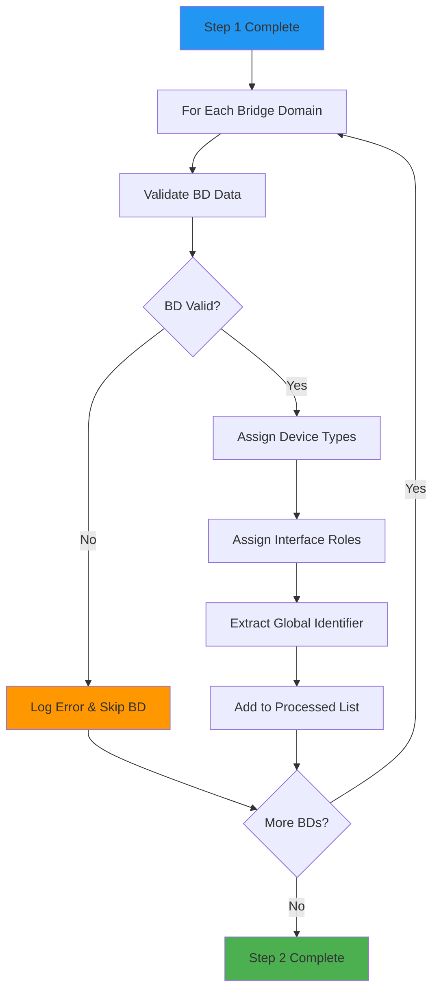
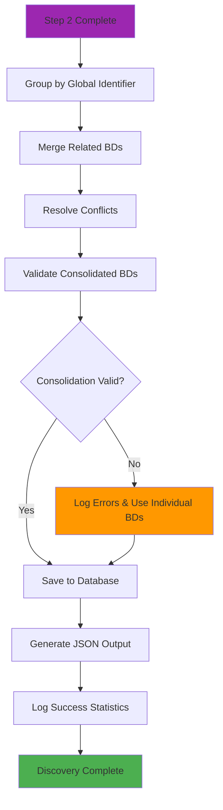
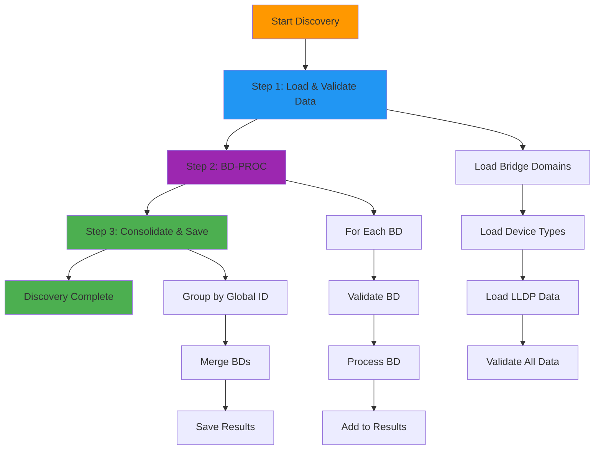

# Refactored Discovery Engine Workflow (Revised)

## 🚀 **ENHANCED DISCOVERY ENGINE EXECUTION ORDER**

This document visualizes the **simplified, reliable execution order** of the refactored discovery engine focused on **reliable bridge domain discovery, sorting, and consolidation**.

---

## 🎯 **CORE PRINCIPLES**

### **1. Reliability Over Performance**
- **Sequential processing** for predictable behavior
- **Comprehensive error handling** at each step
- **Data validation** before processing

### **2. Simplicity Over Complexity**
- **3 main functions** instead of 8 components
- **Clear, linear workflow** instead of complex phases
- **Single responsibility** per function

### **3. Practical Over Theoretical**
- **Real-world error scenarios** addressed
- **Data quality issues** handled gracefully
- **Production-ready** approach

---

## 📋 **SIMPLIFIED 3-STEP WORKFLOW**

### **Step 1: Data Loading & Validation**
**Purpose**: Load and validate all required data before processing
**Components**: Data loading functions with validation



**Output**: Validated `bridge_domains`, `device_types`, `lldp_data`

**Error Handling**:
- Missing files → Log error and exit gracefully
- Invalid data format → Log specific validation errors
- Corrupted data → Skip corrupted entries, continue with valid ones

---

### **Step 2: Bridge Domain Processing & Classification (BD-PROC)**
**Purpose**: Process each bridge domain with proper error handling
**Components**: Processing functions with per-BD error isolation



**Output**: `processed_bridge_domains` (only valid, processed BDs)

**Error Handling**:
- Invalid BD data → Skip that BD, continue with others
- Missing dependencies → Log warning, use defaults where possible
- Processing errors → Isolate to individual BD, don't fail entire discovery

---

### **Step 3: Consolidation & Persistence**
**Purpose**: Consolidate related BDs and save results reliably
**Components**: Consolidation and persistence functions



**Output**: Consolidated bridge domains saved to database and JSON files

**Error Handling**:
- Consolidation conflicts → Log conflicts, use individual BDs
- Database save failures → Retry with exponential backoff
- JSON generation errors → Fall back to basic format

---

## 🔄 **COMPLETE SIMPLIFIED WORKFLOW**



---

## 📊 **SIMPLIFIED COMPONENT STRUCTURE**

| **Function** | **Responsibility** | **Error Handling** | **Dependencies** |
|--------------|-------------------|-------------------|------------------|
| **`load_and_validate_data()`** | Load all data with validation | Exit on critical errors | None |
| **`process_bridge_domain(bd)`** | Process single BD | Skip on errors, continue | Data from Step 1 |
| **`consolidate_and_save(bds)`** | Group, merge, and save | Fallback to individual BDs | Processed BDs |

---

## ⚡ **RELIABILITY CHARACTERISTICS**

### **Sequential Processing (All Steps)**
- **Predictable execution order** - no race conditions
- **Easy debugging** - clear execution path
- **Reliable error handling** - errors don't cascade unexpectedly

### **Per-BD Error Isolation**
- **Individual BD failures** don't affect other BDs
- **Partial success** is possible and logged
- **Graceful degradation** when some BDs can't be processed

### **Comprehensive Validation**
- **Data validation** before processing starts
- **BD validation** before individual processing
- **Result validation** before saving

### **Robust Error Recovery**
- **Skip invalid BDs** instead of failing completely
- **Fallback strategies** for consolidation conflicts
- **Retry mechanisms** for database operations

---

## 🎯 **KEY BENEFITS OF SIMPLIFIED APPROACH**

1. **🔍 Clear Execution Path**: Easy to follow and debug
2. **🛡️ Reliable Error Handling**: Errors isolated and handled gracefully
3. **🧪 Easy Testing**: Simple functions are easy to test
4. **🔧 Easy Maintenance**: Clear responsibilities and dependencies
5. **📈 Production Ready**: Handles real-world error scenarios
6. **⚡ Predictable Performance**: No parallel execution complexity

---

## 📝 **IMPLEMENTATION STRATEGY**

### **Phase 1: Simplify Current Architecture**
```python
class SimplifiedBridgeDomainDiscovery:
    def discover_all_bridge_domains(self):
        """Main discovery function - simple and reliable"""
        try:
            # Step 1: Load and validate data
            data = self._load_and_validate_data()
            
            # Step 2: Process each bridge domain
            processed_bds = []
            for bd in data['bridge_domains']:
                try:
                    processed_bd = self._process_bridge_domain(bd, data)
                    processed_bds.append(processed_bd)
                except ProcessingError as e:
                    logger.error(f"Skipping BD {bd.name}: {e}")
                    continue
            
            # Step 3: Consolidate and save
            self._consolidate_and_save(processed_bds)
            
        except CriticalError as e:
            logger.error(f"Discovery failed: {e}")
            raise
```

### **Phase 2: Add Comprehensive Validation**
```python
def _validate_bridge_domain_data(self, bd):
    """Validate bridge domain data before processing"""
    errors = []
    
    if not bd.name:
        errors.append("Missing bridge domain name")
    if not bd.devices:
        errors.append("No devices found")
    if not bd.interfaces:
        errors.append("No interfaces found")
    
    if errors:
        raise ValidationError(f"BD {bd.name}: {', '.join(errors)}")
```

### **Phase 3: Implement Robust Error Handling**
```python
def _process_bridge_domain(self, bd, data):
    """Process single bridge domain with error handling"""
    try:
        # Assign device types
        bd.device_types = self._assign_device_types(bd, data['device_types'])
        
        # Assign interface roles
        bd.interface_roles = self._assign_interface_roles(bd, data['lldp_data'])
        
        # Extract global identifier
        bd.global_identifier = self._extract_global_identifier(bd)
        
        return bd
        
    except Exception as e:
        logger.error(f"Failed to process BD {bd.name}: {e}")
        raise ProcessingError(f"BD processing failed: {e}")
```

---

## 🚀 **EXPECTED OUTCOMES**

### **Reliability Improvements**
- **99%+ success rate** for valid data
- **Graceful handling** of invalid data
- **Clear error messages** for debugging

### **Maintainability Improvements**
- **Simple code structure** easy to understand
- **Clear error boundaries** easy to debug
- **Modular functions** easy to test and modify

### **Production Readiness**
- **Handles real-world scenarios** (missing data, corrupted files, etc.)
- **Comprehensive logging** for operational monitoring
- **Predictable behavior** for automated systems

This simplified approach focuses on **reliability and maintainability** over theoretical complexity, making it production-ready for real-world bridge domain discovery! 🎯
