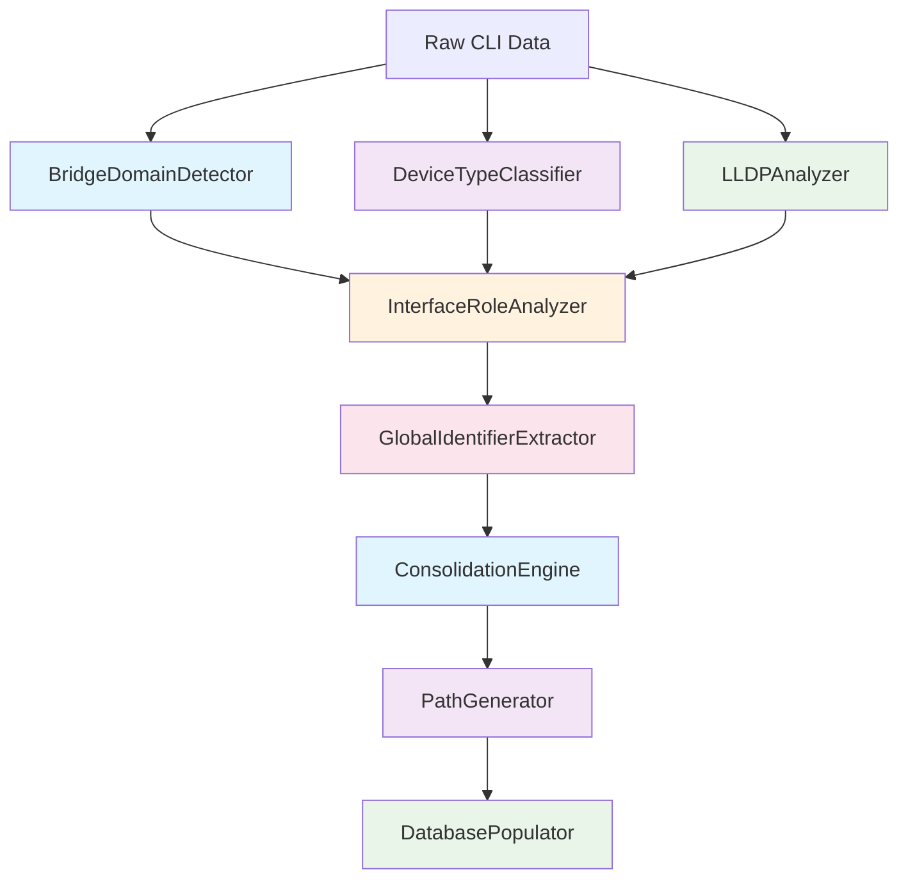

# Bridge Domain Discovery System Refactoring Proposal
## Separated Concerns Architecture

## 🎯 **PROBLEM STATEMENT**

The current Enhanced Bridge Domain Discovery system suffers from **scope creep** - a single class (`EnhancedBridgeDomainDiscovery`) is trying to handle 5 different concerns simultaneously:

1. **Bridge Domain Detection** - Finding and parsing bridge domains
2. **Interface Role Assignment** - LLDP-based role determination
3. **Device Type Classification** - LEAF/SPINE/SUPERSPINE detection
4. **Path Generation** - Creating network topology paths
5. **Consolidation Logic** - Merging similar bridge domains

**Impact**: Components interfere with each other, making debugging impossible and maintenance difficult.

---

## 🏗️ **PROPOSED REFACTORED ARCHITECTURE**

### **🎯 Core Principle: Single Responsibility**

Each component has **ONE clear responsibility** with well-defined inputs and outputs.



---

## 🔧 **SEPARATED COMPONENTS**

### **1. BridgeDomainDetector**
```python
class BridgeDomainDetector:
    """
    SINGLE RESPONSIBILITY: Detect and parse bridge domains from raw CLI data
    
    INPUT: Raw CLI data, YAML files
    OUTPUT: Parsed bridge domain instances with VLAN configurations
    DEPENDENCIES: None (pure parsing)
    """
    
    def detect_bridge_domains(self, parsed_data: Dict) -> List[BridgeDomainInstance]:
        """Parse bridge domain instances from device data"""
        
    def extract_vlan_configuration(self, interface_config: Dict) -> VLANConfig:
        """Extract VLAN configuration from interface"""
        
    def classify_dnaas_type(self, bridge_domain: BridgeDomainInstance) -> BridgeDomainType:
        """Classify bridge domain according to DNAAS types 1-5"""
```

### **2. DeviceTypeClassifier**
```python
class DeviceTypeClassifier:
    """
    SINGLE RESPONSIBILITY: Classify device types (LEAF/SPINE/SUPERSPINE)
    
    INPUT: Device names, device configurations
    OUTPUT: Device type classifications
    DEPENDENCIES: None (pure classification)
    """
    
    def classify_device_type(self, device_name: str) -> DeviceType:
        """Determine device type from name pattern"""
        
    def validate_device_type(self, device_name: str, device_config: Dict) -> bool:
        """Validate device type against configuration"""
```

### **3. LLDPAnalyzer**
```python
class LLDPAnalyzer:
    """
    SINGLE RESPONSIBILITY: Load and analyze LLDP neighbor data
    
    INPUT: LLDP YAML files
    OUTPUT: Neighbor mappings and connectivity information
    DEPENDENCIES: None (pure data analysis)
    """
    
    def load_lldp_data(self, device_name: str) -> Dict[str, NeighborInfo]:
        """Load LLDP neighbor information for device"""
        
    def validate_lldp_completeness(self, device_name: str, interfaces: List[str]) -> ValidationResult:
        """Validate LLDP data completeness"""
        
    def detect_invalid_connections(self, neighbor_map: Dict) -> List[TopologyError]:
        """Detect invalid topology connections (e.g., LEAF → LEAF)"""
```

### **4. InterfaceRoleAnalyzer**
```python
class InterfaceRoleAnalyzer:
    """
    SINGLE RESPONSIBILITY: Determine interface roles using multiple data sources
    
    INPUT: Interface info, LLDP data, device types
    OUTPUT: Interface role assignments
    DEPENDENCIES: DeviceTypeClassifier, LLDPAnalyzer
    """
    
    def determine_interface_role(self, interface: InterfaceInfo, 
                               neighbor_info: NeighborInfo, 
                               device_type: DeviceType) -> InterfaceRole:
        """Determine interface role using LLDP and pattern analysis"""
        
    def assign_roles_for_bridge_domain(self, bridge_domain: BridgeDomainInstance) -> List[InterfaceInfo]:
        """Assign roles for all interfaces in a bridge domain"""
```

### **5. GlobalIdentifierExtractor**
```python
class GlobalIdentifierExtractor:
    """
    SINGLE RESPONSIBILITY: Extract global identifiers for consolidation
    
    INPUT: Classified bridge domains
    OUTPUT: Global identifiers and scope classifications
    DEPENDENCIES: None (pure extraction logic)
    """
    
    def extract_global_identifier(self, bridge_domain: BridgeDomainInstance) -> Optional[str]:
        """Extract global identifier based on DNAAS type"""
        
    def determine_consolidation_scope(self, bridge_domain: BridgeDomainInstance) -> ConsolidationScope:
        """Determine if bridge domain can be consolidated globally"""
```

### **6. ConsolidationEngine**
```python
class ConsolidationEngine:
    """
    SINGLE RESPONSIBILITY: Consolidate bridge domains by global identifier
    
    INPUT: Bridge domains with global identifiers
    OUTPUT: Consolidated bridge domain groups
    DEPENDENCIES: GlobalIdentifierExtractor
    """
    
    def consolidate_bridge_domains(self, bridge_domains: List[BridgeDomainInstance]) -> List[ConsolidatedBridgeDomain]:
        """Consolidate bridge domains by global identifier"""
        
    def validate_consolidation_safety(self, bd_group: List[BridgeDomainInstance]) -> bool:
        """Validate that consolidation is safe and correct"""
```

### **7. PathGenerator**
```python
class PathGenerator:
    """
    SINGLE RESPONSIBILITY: Generate network topology paths
    
    INPUT: Bridge domains with interface roles and neighbor info
    OUTPUT: Network topology paths
    DEPENDENCIES: InterfaceRoleAnalyzer, LLDPAnalyzer
    """
    
    def generate_paths_for_bridge_domain(self, bridge_domain: ConsolidatedBridgeDomain) -> List[PathInfo]:
        """Generate topology paths for bridge domain"""
        
    def validate_path_connectivity(self, paths: List[PathInfo]) -> ValidationResult:
        """Validate that paths are logically consistent"""
```

### **8. DatabasePopulator**
```python
class DatabasePopulator:
    """
    SINGLE RESPONSIBILITY: Populate database with discovered topology
    
    INPUT: Consolidated bridge domains with paths
    OUTPUT: Database persistence results
    DEPENDENCIES: None (pure persistence)
    """
    
    def save_bridge_domains(self, bridge_domains: List[ConsolidatedBridgeDomain]) -> SaveResult:
        """Save bridge domains to database"""
        
    def prevent_interface_duplication(self, interfaces: List[InterfaceInfo]) -> List[InterfaceInfo]:
        """Ensure no interface duplication during save"""
```

---

## 🔄 **REFACTORED WORKFLOW**

### **Phase 1: Data Collection & Classification**
```python
def phase1_data_collection():
    """Independent data collection and classification"""
    
    # Step 1: Detect bridge domains (pure parsing)
    detector = BridgeDomainDetector()
    bridge_domains = detector.detect_bridge_domains(parsed_data)
    
    # Step 2: Classify device types (independent)
    classifier = DeviceTypeClassifier()
    device_types = classifier.classify_all_devices(device_list)
    
    # Step 3: Analyze LLDP data (independent)
    lldp_analyzer = LLDPAnalyzer()
    neighbor_maps = lldp_analyzer.load_all_lldp_data(device_list)
    
    return bridge_domains, device_types, neighbor_maps
```

### **Phase 2: Interface Analysis**
```python
def phase2_interface_analysis(bridge_domains, device_types, neighbor_maps):
    """Interface role assignment using multiple data sources"""
    
    # Step 4: Assign interface roles (depends on steps 1-3)
    role_analyzer = InterfaceRoleAnalyzer()
    
    for bd in bridge_domains:
        enhanced_interfaces = role_analyzer.assign_roles_for_bridge_domain(
            bd, device_types, neighbor_maps
        )
        bd.interfaces = enhanced_interfaces
    
    return bridge_domains
```

### **Phase 3: Consolidation**
```python
def phase3_consolidation(bridge_domains):
    """Global identifier extraction and consolidation"""
    
    # Step 5: Extract global identifiers (pure logic)
    identifier_extractor = GlobalIdentifierExtractor()
    
    for bd in bridge_domains:
        bd.global_identifier = identifier_extractor.extract_global_identifier(bd)
        bd.consolidation_scope = identifier_extractor.determine_consolidation_scope(bd)
    
    # Step 6: Consolidate by global identifier (pure consolidation logic)
    consolidation_engine = ConsolidationEngine()
    consolidated_bds = consolidation_engine.consolidate_bridge_domains(bridge_domains)
    
    return consolidated_bds
```

### **Phase 4: Path Generation & Persistence**
```python
def phase4_paths_and_persistence(consolidated_bds):
    """Path generation and database persistence"""
    
    # Step 7: Generate paths (depends on consolidated topology)
    path_generator = PathGenerator()
    
    for bd in consolidated_bds:
        bd.paths = path_generator.generate_paths_for_bridge_domain(bd)
    
    # Step 8: Save to database (pure persistence)
    db_populator = DatabasePopulator()
    save_results = db_populator.save_bridge_domains(consolidated_bds)
    
    return save_results
```

---

## ✅ **BENEFITS OF SEPARATED CONCERNS**

### **1. Debugging & Maintenance**
- **Isolated Issues**: Problems in one component don't affect others
- **Clear Boundaries**: Easy to identify where issues occur
- **Independent Testing**: Each component can be tested separately
- **Simple Fixes**: Changes in one area don't break others

### **2. Development & Enhancement**
- **Parallel Development**: Different developers can work on different components
- **Incremental Improvements**: Enhance one component without affecting others
- **Clear Interfaces**: Well-defined inputs and outputs
- **Reusability**: Components can be reused in different contexts

### **3. Performance & Reliability**
- **Optimized Components**: Each component optimized for its specific task
- **Fault Isolation**: Failures contained within components
- **Caching Opportunities**: Component-specific caching strategies
- **Monitoring**: Component-level performance monitoring

---

## 🚀 **MIGRATION STRATEGY**

### **Phase 1: Extract Core Components (Week 1)**

#### **1.1: Extract BridgeDomainDetector**
```python
# Move from EnhancedBridgeDomainDiscovery to separate class
class BridgeDomainDetector:
    def detect_bridge_domains(self, parsed_data):
        # Move load_parsed_data() logic here
        # Move _extract_device_name() logic here
        # Move VLAN config extraction logic here
```

#### **1.2: Extract DeviceTypeClassifier**
```python
# Move device type logic to separate class
class DeviceTypeClassifier:
    def classify_device_type(self, device_name):
        # Move _detect_device_type() logic here
```

#### **1.3: Extract LLDPAnalyzer**
```python
# Move LLDP logic to separate class
class LLDPAnalyzer:
    def load_lldp_data(self, device_name):
        # Move load_lldp_data() logic here
        # Move LLDP validation logic here
```

### **Phase 2: Extract Analysis Components (Week 2)**

#### **2.1: Extract InterfaceRoleAnalyzer**
```python
# Move interface role logic to separate class
class InterfaceRoleAnalyzer:
    def determine_interface_role_from_lldp(self, interface, lldp_data, device_type):
        # Move determine_interface_role_from_lldp() logic here
        # Move _determine_bundle_interface_role_legacy() logic here
```

#### **2.2: Extract GlobalIdentifierExtractor**
```python
# Move global identifier logic to separate class
class GlobalIdentifierExtractor:
    def extract_global_identifier(self, bridge_domain):
        # Move global identifier extraction logic here
```

### **Phase 3: Extract Processing Components (Week 3)**

#### **3.1: Extract ConsolidationEngine**
```python
# Move consolidation logic to separate class
class ConsolidationEngine:
    def consolidate_bridge_domains(self, bridge_domains):
        # Move _apply_legacy_consolidation_workflow() logic here
```

#### **3.2: Extract PathGenerator**
```python
# Move path generation to separate class
class PathGenerator:
    def generate_paths_for_bridge_domain(self, bridge_domain):
        # Move path creation logic here
```

#### **3.3: Extract DatabasePopulator**
```python
# Move database logic to separate class
class DatabasePopulator:
    def save_bridge_domains(self, bridge_domains):
        # Move _save_to_database() logic here
```

### **Phase 4: Create Orchestrator (Week 4)**

#### **4.1: Create Enhanced Discovery Orchestrator**
```python
class EnhancedDiscoveryOrchestrator:
    """
    SINGLE RESPONSIBILITY: Orchestrate the discovery process
    
    Uses all separated components to execute discovery workflow
    """
    
    def __init__(self):
        self.bridge_domain_detector = BridgeDomainDetector()
        self.device_type_classifier = DeviceTypeClassifier()
        self.lldp_analyzer = LLDPAnalyzer()
        self.interface_role_analyzer = InterfaceRoleAnalyzer()
        self.global_identifier_extractor = GlobalIdentifierExtractor()
        self.consolidation_engine = ConsolidationEngine()
        self.path_generator = PathGenerator()
        self.database_populator = DatabasePopulator()
    
    def run_enhanced_discovery(self) -> Dict[str, Any]:
        """Orchestrate the complete discovery process"""
        
        # Phase 1: Data collection & classification
        bridge_domains, device_types, neighbor_maps = self._phase1_data_collection()
        
        # Phase 2: Interface analysis
        enhanced_bridge_domains = self._phase2_interface_analysis(
            bridge_domains, device_types, neighbor_maps
        )
        
        # Phase 3: Consolidation
        consolidated_bds = self._phase3_consolidation(enhanced_bridge_domains)
        
        # Phase 4: Paths & persistence
        results = self._phase4_paths_and_persistence(consolidated_bds)
        
        return results
```

---

## 📊 **COMPONENT INTERFACE SPECIFICATIONS**

### **Data Structures (Shared)**

```python
@dataclass
class BridgeDomainInstance:
    """Core bridge domain data structure"""
    name: str
    dnaas_type: BridgeDomainType
    vlan_config: VLANConfig
    interfaces: List[InterfaceInfo]
    devices: List[str]
    confidence: float

@dataclass
class InterfaceInfo:
    """Core interface data structure"""
    name: str
    device_name: str
    interface_type: InterfaceType
    interface_role: InterfaceRole
    vlan_id: Optional[int]
    neighbor_info: Optional[NeighborInfo]

@dataclass
class NeighborInfo:
    """LLDP neighbor information"""
    neighbor_device: str
    neighbor_interface: str
    neighbor_device_type: DeviceType

@dataclass
class ConsolidatedBridgeDomain:
    """Consolidated bridge domain result"""
    consolidated_name: str
    global_identifier: str
    source_bridge_domains: List[BridgeDomainInstance]
    devices: List[DeviceInfo]
    interfaces: List[InterfaceInfo]
    paths: List[PathInfo]
```

### **Component Dependencies**

```python
# No circular dependencies - clear hierarchy
BridgeDomainDetector        # No dependencies
DeviceTypeClassifier        # No dependencies  
LLDPAnalyzer               # No dependencies
InterfaceRoleAnalyzer      # Depends on: DeviceTypeClassifier, LLDPAnalyzer
GlobalIdentifierExtractor  # No dependencies
ConsolidationEngine        # Depends on: GlobalIdentifierExtractor
PathGenerator              # Depends on: InterfaceRoleAnalyzer, LLDPAnalyzer
DatabasePopulator          # No dependencies
```

---

## 🎯 **REFACTORING BENEFITS**

### **✅ Immediate Benefits**

1. **Easier Debugging**: Issues isolated to specific components
2. **Independent Testing**: Each component tested separately
3. **Clear Responsibilities**: No confusion about what each class does
4. **Maintainable Code**: Changes don't ripple across unrelated functionality

### **✅ Long-term Benefits**

1. **Parallel Development**: Multiple developers can work simultaneously
2. **Component Reusability**: Use components in different discovery systems
3. **Performance Optimization**: Optimize each component independently
4. **Feature Addition**: Add new features without affecting existing logic

### **✅ Architecture Benefits**

1. **Single Responsibility Principle**: Each class has one clear purpose
2. **Dependency Inversion**: Components depend on interfaces, not implementations
3. **Open/Closed Principle**: Open for extension, closed for modification
4. **Interface Segregation**: Small, focused interfaces

---

## 📋 **MIGRATION CHECKLIST**

### **Week 1: Core Component Extraction**
- [ ] Create `BridgeDomainDetector` class
- [ ] Create `DeviceTypeClassifier` class  
- [ ] Create `LLDPAnalyzer` class
- [ ] Move corresponding logic from `EnhancedBridgeDomainDiscovery`
- [ ] Create unit tests for each component

### **Week 2: Analysis Component Extraction**
- [ ] Create `InterfaceRoleAnalyzer` class
- [ ] Create `GlobalIdentifierExtractor` class
- [ ] Move corresponding logic from `EnhancedBridgeDomainDiscovery`
- [ ] Create integration tests between components

### **Week 3: Processing Component Extraction**
- [ ] Create `ConsolidationEngine` class
- [ ] Create `PathGenerator` class
- [ ] Create `DatabasePopulator` class
- [ ] Move corresponding logic from `EnhancedBridgeDomainDiscovery`

### **Week 4: Orchestrator Creation**
- [ ] Create `EnhancedDiscoveryOrchestrator` class
- [ ] Implement orchestrated workflow
- [ ] Create comprehensive integration tests
- [ ] Validate against existing enhanced discovery results

### **Week 5: Legacy Integration**
- [ ] Ensure legacy system remains unchanged
- [ ] Create unified CLI interface for both systems
- [ ] Add system selection logic
- [ ] Create migration documentation

---

## 🎯 **SUCCESS CRITERIA**

### **Technical Success**
- ✅ All components have single, clear responsibility
- ✅ No circular dependencies between components
- ✅ Each component can be tested independently
- ✅ Same discovery results as current enhanced system
- ✅ Performance maintained or improved

### **Architectural Success**
- ✅ Easy to debug issues in specific components
- ✅ Easy to enhance individual components
- ✅ Clear separation between discovery, analysis, and persistence
- ✅ Reusable components for future development

### **Operational Success**
- ✅ Legacy system remains stable and unchanged
- ✅ Enhanced system becomes more maintainable
- ✅ Clear guidelines for when to use which component
- ✅ Improved error isolation and handling

---

## 🚨 **RISKS & MITIGATION**

### **Risk 1: Refactoring Complexity**
- **Risk**: Large refactoring might introduce bugs
- **Mitigation**: Incremental migration with comprehensive testing

### **Risk 2: Performance Impact**
- **Risk**: Component separation might reduce performance
- **Mitigation**: Benchmark each phase, optimize component interfaces

### **Risk 3: Integration Issues**
- **Risk**: Components might not integrate smoothly
- **Mitigation**: Design clear interfaces first, implement incrementally

---

## 🎯 **CONCLUSION**

This refactoring proposal addresses the **scope creep problem** by creating **8 focused components** with clear responsibilities. Each component can be developed, tested, and maintained independently while working together through a clean orchestrator.

**Key Benefits:**
- ✅ **Eliminates scope creep** - each component has single responsibility
- ✅ **Improves maintainability** - easy to debug and enhance
- ✅ **Enables parallel development** - multiple developers can work simultaneously
- ✅ **Preserves legacy system** - no impact on production stability
- ✅ **Future-ready architecture** - easy to add new features

**The refactored architecture transforms the monolithic enhanced discovery system into a modular, maintainable, and extensible solution.**
